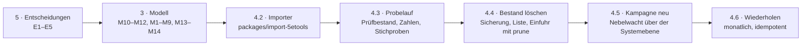

# Abgleich mit 5e.tools

Stand 2026-10-08. Quelle: [`5etools-mirror-3/5etools-src`](https://github.com/5etools-mirror-3/5etools-src),
Verzeichnis `data/`, Stand b906158 (2026-09-23). Gezählt wurde mit einem
Skript über alle JSON-Dateien; die Zahlen unten sind gemessen, nicht
geschätzt. Verglichen wurde gegen das Register in `packages/registry` nach
PR #6 (31 Arten, 21 geteilte Typen, 42 Kantenarten).

> **Entschieden am 2026-10-08** (D47): 2014 als Basis, alles ausser
> 2024, einmaliges Laden als Artikel unserer Typen, alles englisch.
> Was das an diesem Dokument ändert und in welcher Reihenfolge gebaut
> wird: [5etools-Arbeitsplan.md](5etools-Arbeitsplan.md). Wo beide
> widersprechen, gilt der Arbeitsplan.

Drei Fragen, in dieser Reihenfolge:

1. **Was ist 5e.tools eigentlich** — welche Arten es gibt, wie ein Eintrag
   aussieht, was davon Daten sind und was Darstellung (Abschnitt 1).
2. **Was fehlt bei uns, was muss anders** — jede 5e.tools-Art mit ihrem
   Gegenstück im Register, und je Art der Stand: steht, anpassen, fehlt,
   weglassen (Abschnitte 2 und 3).
3. **Wie kommt alles herein** — die Vorgehensweise, 5e.tools als Grundlage
   des Bestands zu übernehmen, den heutigen Bestand eingeschlossen
   (Abschnitt 4), und was davon nur Mike entscheiden kann (Abschnitt 5).

---

## 1. Was 5e.tools ist

### 1.1 Eine Datei je Art, ein Objekt je Eintrag

`data/` hält je Art eine JSON-Datei (oder ein Verzeichnis, bei Bestiarium,
Zaubern, Klassen, Büchern): oben ein Schlüssel mit dem Artnamen, darunter
eine Liste von Objekten. **Die Identität eines Eintrags ist `name|source`**
— „Goblin|MM" und „Goblin Warrior|XMM" sind zwei Einträge, und derselbe
Name kommt in verschiedenen Quellen vor. Alles, was auf einen Eintrag
zeigt, zeigt so: `{@creature Goblin|MM}`, `{@spell fireball}` (ohne Quelle:
die Vorgabe, PHB), `{@item longsword|phb}`.

Insgesamt **25 864 Einträge in 85 Arten** (Bilder und Varianten
mitgezählt); davon tragen 22 Arten mehr als 200 Einträge  und die ersten
vier (Monster  Gegenstände  Tabellen  Klassenmerkmale) machen die Hälfte aus.

### 1.2 Was ein Eintrag trägt

Am Beispiel Goblin (gekürzt):

```json
{ "name": "Goblin", "source": "MM", "page": 166, "srd": true,
  "size": ["S"], "type": {"type": "humanoid", "tags": ["goblinoid"]},
  "alignment": ["N", "E"],
  "ac": [{"ac": 15, "from": ["{@item leather armor|phb}", "{@item shield|phb}"]}],
  "hp": {"average": 7, "formula": "2d6"}, "speed": {"walk": 30},
  "str": 8, "dex": 14, "con": 10, "int": 10, "wis": 8, "cha": 8,
  "skill": {"stealth": "+6"}, "senses": ["darkvision 60 ft."], "passive": 9,
  "languages": ["Common", "Goblin"], "cr": "1/4",
  "trait":  [{"name": "Nimble Escape", "entries": ["The goblin can take the {@action Disengage} … as a bonus action …"]}],
  "action": [{"name": "Scimitar", "entries": ["{@atk mw} {@hit 4} to hit, reach 5 ft., one target. {@h}5 ({@damage 1d6 + 2}) slashing damage."]}],
  "environment": ["underdark", "grassland", "forest", "hill"],
  "attachedItems": ["scimitar|phb", "shortbow|phb"],
  "reprintedAs": ["Goblin Warrior|XMM"], "hasToken": true, "hasFluff": true }
```

Drei Dinge daran sind für uns die Arbeit:

- **`entries` ist ein Darstellungsbaum**, kein Text: eine Liste aus
  Zeichenketten und Objekten (`{type: "entries" | "list" | "table" |
  "inset" | "quote" | "item" | …}`), beliebig geschachtelt. Der Text
  darin trägt **Inline-Marken** `{@art name|quelle|anzeige}`: `@creature`,
  `@spell`, `@item`, `@condition`, `@skill`, `@action`, `@class`, `@race`,
  `@feat`, `@background`, `@deity`, `@table`, `@book`, `@filter` (ein
  Link auf eine gefilterte Liste), und die Rechenmarken `@dice`,
  `@damage`, `@hit`, `@dc`, `@atk`, `@h`, `@recharge`, `@scaledamage`.
- **`_copy` ist Vererbung**: 1 143 der 4 559 Monster stehen nicht
  ausgeschrieben, sondern sagen „wie X, mit diesen Änderungen" — und die
  Änderungen (`_mod`) sind Bearbeitungsschritte am Baum (`appendArr`,
  `replaceTxt`, `removeArr`), keine Feldwerte. Dasselbe bei Unterarten
  und Unterklassen.
- **Zwei Ausgaben nebeneinander.** Seit 2024 gibt es jede Kernregel
  zweimal: `PHB`/`MM`/`DMG` (2014, `edition: "classic"`) und
  `XPHB`/`XMM`/`XDMG` (2024, Quellen mit `X`). `reprintedAs` zeigt von der
  alten auf die neue Fassung. Das ist **genau unser Stapel** (D45,
  [Datenmodell §8](Datenmodell.md)): eine Ebene je Quelle, und `overrides`
  von der neuen auf die alte Zeile.

Was daneben steht und für uns **keine Daten** sind: `hasToken`,
`hasFluff`, `hasFluffImages` (Flaggen, dass es eine Bilddatei im
getrennten Bild-Repo gibt), `soundClip`, `*Tags` (vorgerechnete
Filterschlüssel: `damageTags`, `miscTags`, `senseTags`), `srd`/`srd52`/
`basicRules*` (Lizenzflaggen — die brauchen wir, siehe 5.1), `referenceSources`,
`foundry-*.json` (Daten für Foundry VTT), `generated/` (aus den Büchern
herausgerechnete Tabellen und Regeln — die nehmen wir, aber nicht die
Bücher selbst).

### 1.3 Die Lizenzlage, einmal klar

Der **Code** von 5e.tools ist MIT. Die **Daten** sind der Wortlaut von
Wizards of the Coast. Frei ist davon, was im SRD steht: SRD 5.1 (2014,
Flagge `srd`) und SRD 5.2 (2024, Flagge `srd52`), beide CC-BY-4.0. Alles
andere — Volo's, Xanathar's, Tasha's, die Abenteuer — ist urheberrechtlich
geschützt und steht in 5e.tools nicht rechtmässig.

Für uns heisst das: **am eigenen Tisch** ist alles unproblematisch; auf
einer Seite, die `public` ausliefert (unsere Vorgabe, D-Sichtbarkeit), ist
nur das SRD sauber. Die Flaggen stehen an jedem Eintrag, der Importer kann
danach sieben. Die Zahlen:

| Art | gesamt | SRD 5.1 | SRD 5.2 | 2024-Quellen |
|---|---:|---:|---:|---:|
| monster | 4 559 | 323 | 336 | 522 |
| item (+ baseitem, itemGroup) | 2 861 | 590 | 575 | 894 |
| spell | 969 | 319 | 339 | 486 |
| classFeature / subclassFeature | 2 176 | 337 | 353 | 820 |
| class / subclass | 360 | 24 | 24 | 122 |
| feat | 305 | 1 | 17 | 92 |
| background | 171 | 1 | 4 | 16 |
| race / subrace | 258 | 18 | 9 | 10 |
| condition / disease / status | 64 | 20 | 21 | 21 |
| variantrule | 231 | 1 | 115 | 137 |

Das SRD allein ist eine spielbare Grundlage (Grundklassen, ein Unterklasse
je Klasse, die Monster des Monster Manual, die Zauber des PHB); die
Breite — 300 Talente, 330 Unterklassen, 4 500 Monster — kommt nur mit
dem Rest. Das ist Entscheidung E1 in Abschnitt 5.

---

## 2. Jede 5e.tools-Art und ihr Gegenstück

Alle 85 Arten, nach Bereich gruppiert. **Stand** heisst: *steht* — die Art
bildet es heute ab; *anpassen* — die Art gibt es, ihr fehlen Felder,
Kanten oder Aufzählungswerte; *fehlt* — es gibt keine Art dafür;
*weglassen* — nicht übernehmen, mit Grund. Die Nummern **M1–M14** zeigen
auf die Modelländerungen in Abschnitt 3.

### 2.1 Kreaturen

| 5e.tools | n | Gegenstück | Stand | Was dazu nötig ist |
|---|---:|---|---|---|
| `monster` | 4 559 | `Statblock` (Vorlage; eine `Creature` ist bei uns die *Figur* mit Namen — ein Monster aus dem Buch ist der Zahlenblock, aus dem Instanzen entstehen, D82) | **anpassen** | Sprachen, Zustandsimmunitäten, Übungen mit Bonus, Legendäre Aktionen (Anzahl), Zauberwirken, Token, Lore — **M5**; `size` abbilden; `type.tags` → Marken; `environment` → Marken; `trait/action/bonus/reaction/legendary/mythic/lair` → `Rule` über `composedOf` (steht, bis auf `mythic` — **M1**); `attachedItems` → Kante `equips` (**M5**); `_copy` auflösen, `variantOf` auf das Original; `reprintedAs` → `overrides` (**M9**) |
| `monsterFluff` | 4 170 | `Statblock.lore` + Bilder | **anpassen** | `Statblock` nimmt `Lore` und `Image` dazu (**M5**) |
| `legendaryGroup` | 188 | `Rule` mit `kind: lair` (steht) und `regional` (**M1**), `composedOf` vom Statblock | **anpassen** | Aufzählungswert `regional`, `mythicEncounter` → `mythic` |
| `monsterTemplate` | 66 | — | **weglassen** | Eine Schablone (`apply`), die ein anderes Monster umbaut (Halbdrache, Skelett-von). Der Text dazu wird eine `Rule kind: rule`; die Anwendung ist eine Handlung am Tisch, kein Artikel |
| `monsterfeatures` | 25 | `Table` | **steht** | DMG-Tabelle „Monster Features"; eine Tabelle |
| `object` | 37 | `Statblock` mit `creatureType: object` | **anpassen** | nur `size` (**M5**) und `actionEntries` → `composedOf` |
| `vehicle` | 39 | — | **fehlt** | Schiffe, Höllenmaschinen, Spelljammer: Rumpf, Steuerung, Antrieb, Waffen als *Bauteile* mit eigener AC/HP, Besatzung, Fracht, Tempo. Ein eigener Typ `Vehicle` mit Bauteilen als `Rule` oder Unterartikeln — **nicht jetzt** (Nebelwacht ist eine Stadt; E4) |
| `vehicleUpgrade` | 31 | — | **weglassen** | mit `vehicle` |

### 2.2 Zauber

| 5e.tools | n | Gegenstück | Stand | Was dazu nötig ist |
|---|---:|---|---|---|
| `spell` | 969 | — | **fehlt** | Neue Art `Spell` erbt `Rule` (**M2**): Grad 0–9, Schule (Aufzählung), Wirkzeit (`{number, unit, condition}`), Reichweite (`{type: point/radius/cone/line/self/touch/sight, distance}`), Komponenten V/S/M (+ Materialtext, Kosten, verbraucht), Dauer (`instant/timed/permanent/special`, Konzentration), Ritual, „Auf höheren Graden", Rettungswurf, Schaden- und Zustandsmarken. Und die Kante `casts` (**M2**): wer ihn kann, wie (vorbereitet, bekannt, angeboren, aus Gegenstand), mit welcher Häufigkeit |
| `spellFluff` | 92 | Bilder | **weglassen** | nur Bilder |
| `psionic` | 52 | — | **weglassen** | Unearthed Arcana, nie erschienen |

### 2.3 Charakterbau

| 5e.tools | n | Gegenstück | Stand | Was dazu nötig ist |
|---|---:|---|---|---|
| `class` | 30 | `PlayerCharacter.class` (ein Wort) | **fehlt** | Neue Art `Class` (**M3**): Trefferwürfel, Hauptattribut, Rettungswürfe, Startübungen (Rüstung, Waffen, Werkzeug, Fertigkeiten *zur Wahl*), Startausrüstung, Multiclass-Voraussetzung, Zauberprogression (voll/halb/drittel/Pakt, Attribut), Name der Unterklassenstufe. Die Stufentabelle (`classTableGroups`: Wutanfälle, Hinterhältiger Angriff, Zauberplätze je Stufe) als `progression` (eine Zeile je Stufe) |
| `subclass` | 330 | — | **fehlt** | `Subclass` mit Kante `subclassOf` → `Class` (**M3**); `additionalSpells` → `casts`-Kanten mit Stufe |
| `classFeature` | 677 | `Rule kind: feature` | **anpassen** | `Rule.level` und Kante `featureOf` (→ `Class`/`Subclass`, mit Stufe) (**M1**, **M3**). Die Klassentabelle entsteht dann aus den Kanten, nicht aus einer Liste |
| `subclassFeature` | 1 499 | `Rule kind: feature` | **anpassen** | wie `classFeature` |
| `optionalfeature` | 221 | `Rule kind: feature` | **anpassen** | `Rule.featureType` (Kampfstil, Anrufung, Manöver, Metamagie, Pakt, Rune, Infusion …) und `Rule.prerequisite` (heute nur an `Feat`) (**M1**); `consumes` (Überlegenheitswürfel) als Text |
| `race` | 160 | `PlayerCharacter.ancestry` (ein Wort), `Creature.species` | **fehlt** | Neue Art `Ancestry` (**M3**): Grösse, Tempo, Attributsboni, Alter, Dunkelsicht, Sprachen, Kreaturentyp; Merkmale als `Rule kind: trait` über `grants`. `Creature.species` bleibt ein Wort — eine Goblinfigur ist keine spielbare Abstammung |
| `subrace` | 98 | — | **fehlt** | `Ancestry` mit Kante `subraceOf`; `_copy` wie bei Monstern auflösen |
| `raceFluff` | 221 | `Ancestry.lore` | **fehlt** | mit `Ancestry` |
| `background` | 171 | — | **fehlt** | Neue Art `Background` (**M3**): Fertigkeits-, Werkzeug-, Sprachübungen, Startausrüstung, Merkmal (`Rule`), 2024: Ursprungstalent und Attribute; die vier Charakterzug-Tabellen als `Table` mit `tableFor` |
| `backgroundFluff` | 170 | `Background.lore` | **fehlt** | mit `Background` |
| `feat` | 305 | `Feat` | **anpassen** | `category` (2024: General, Origin, Fighting Style, Epic Boon), `ability` (Attributswahl); Übungen und Zauber, die ein Talent gibt, zuerst als Text — eine Kante `grants` kommt, wenn der Bogen sie liest (**M1**) |
| `featFluff` | 44 | Bilder | **weglassen** | nur Bilder |
| `charoption` | 44 | `Rule kind: option` | **anpassen** | Geheimnisse, übernatürliche Gaben aus Abenteuern: ein Aufzählungswert (**M1**) |
| `lifeBackground`, `lifeClass` | 25 | `Table` | **steht** | „This Is Your Life" (XGE): Tabellen |

### 2.4 Gegenstände

| 5e.tools | n | Gegenstück | Stand | Was dazu nötig ist |
|---|---:|---|---|---|
| `item` | 2 512 | `Item` / `Weapon` / `Armor` | **anpassen** | **M4**: `tier`, Einstimmung (ja/nein + Bedingung), Ladungen und Aufladung, Boni (Waffe, RK, Zauberangriff, Rettungswurf), `itemType` als Aufzählungszeile aus `itemType`, `rarity` um `none`/`varies` ergänzt und englisch (E3), `weight` als Mass mit `unit: lb`, `attachedSpells` → `casts` vom Gegenstand; `baseItem` → `variantOf`; `containerCapacity` → der Gegenstand `carries` ein `Inventory` |
| `baseitem` | 230 | `Weapon` / `Armor` / `Item` | **anpassen** | Waffe: `damage2` (vielseitig), Kategorie einfach/Kriegs-, Munitionsart, Eigenschaften über `hasProperty` → `Rule kind: property` (steht als Kante, fehlt als Aufzählungswert, **M1**); Rüstung: Stärkevoraussetzung, Heimlichkeit-Nachteil, `armorType` als Aufzählung (**M4**) |
| `itemGroup` | 119 | `Item` + `variantOf` von den Mitgliedern | **steht** | „Armor of Resistance" mit sieben Ausprägungen: der Gruppenartikel und je Mitglied `variantOf` |
| `magicvariant` | 230 | `Item` als Vorlage | **anpassen** | „+1 Weapon" gilt für *jede* Waffe; 5e.tools erzeugt „+1 Longsword" beim Lesen. Bei uns: die Variante ist ein Artikel mit `appliesTo` (Marken: weapon, armor, ammunition), und das konkrete Stück entsteht am Tisch als Instanz des Grundgegenstands (`instanceOf`, D82) — **M4** erweitert `instanceOf` auf `Item` |
| `itemType` | 67 | Aufzählungszeile `ItemType` | **anpassen** | Kürzel → Name (`M` martial weapon, `HA` heavy armor, `WD` wand, `$` treasure …) (**M4**) |
| `itemProperty` | 27 | `Rule kind: property` | **anpassen** | Aufzählungswert (**M1**); Vielseitig, Finesse, Leicht … stehen heute schon als Regeln im Bestand, nur mit `kind: feature` |
| `itemMastery` | 8 | `Rule kind: mastery` | **anpassen** | 2024: Waffenmeisterschaft; Aufzählungswert (**M1**), Kante `hasProperty` reicht |
| `itemEntry`, `itemTypeAdditionalEntries` | 15 | — | **weglassen** | Textschablonen, die der Importer beim Lesen einsetzt |
| `itemFluff` | 980 | Bilder | **weglassen** | nur Bilder (829 von 980 ohne Text) |

### 2.5 Regeln, Zustände, Tabellen

| 5e.tools | n | Gegenstück | Stand | Was dazu nötig ist |
|---|---:|---|---|---|
| `condition` | 30 | `Rule kind: condition` | **steht** | 15 davon stehen schon im Bestand (`blinded` …), englisch |
| `status` | 5 | `Rule kind: status` | **anpassen** | Konzentration, Überrascht: Aufzählungswert (**M1**) |
| `disease` | 29 | `Rule kind: disease` | **anpassen** | Aufzählungswert (**M1**); die Kerzengassen-Seuche ist heute ein `Event` — sie bekäme eine Regel daneben |
| `action` | 48 | `Rule kind: action` | **steht** | Ausweichen, Spurt … |
| `sense` | 8 | `Rule kind: sense` | **anpassen** | Aufzählungswert (**M1**); `Statblock.senses` bleibt Text, verweist über `autolink` |
| `skill` | 36 | `Skill` | **steht** | 18 × 2014 + 18 × 2024; macht die Aufzählungszeile `Skill` und die Einstellung `skills` überflüssig (**M6**) |
| `language` | 201 | Aufzählungszeile `Language` (4 Werte) | **fehlt** | Neue Art `Language` (**M6**): `type` standard/exotic/secret, Schrift, typische Sprecher. Und `Proficiencies.proficient` liest dann aus Artikeln statt aus einer Zeile (M6) |
| `languageScript` | 6 | `Language.script` | **fehlt** | mit `Language` |
| `variantrule` | 245 | `Rule kind: rule` | **anpassen** | Regeltext als Abschnitt (Flankieren, Wahnsinn, Reisetempo …); Aufzählungswert `rule` und `ruleType` C/O/V (**M1**). 14 davon sind aus den Büchern herausgerechnet (`generated/`) — **so kommt Regeltext herein**, nicht über die Bücher |
| `table` | 2 381 | `Table` | **anpassen** | **M8**: Spaltenbeschriftungen und Zeilen aus Zellen; heute hat `Table` nur `rows` als Einträge mit Gewicht. 2 368 davon kommen aus den Büchern (`generated/`), 13 stehen für sich |
| `tableGroup` | 22 | `Table` + `partOf` | **steht** | mehrere Tabellen unter einem Titel |
| `encounter` | 42 | `Table kind: encounter` | **steht** | Zufallsbegegnungen je Gelände und Stufe; `entry`-Kanten mit Gewicht |
| `hoard`, `individual`, `magicItems`, `gems`, `artObjects`, `dragon`, `dragonMundaneItems` | 100 | `Table kind: loot`, geschachtelt | **steht** | `entry` erlaubt Tabelle → Tabelle (REQ-186); Münzen als Zeile mit Würfelausdruck |
| `name` | 10 | `Table kind: name` | **steht** | Namenstabellen je Volk |
| `reward` | 278 | `Rule kind: reward` | **anpassen** | Segen, Charms, Epische Gaben, Frömmigkeit; Aufzählungswert und `rewardType` (**M1**) |
| `cult` | 30 | `Faction kind: cult` | **anpassen** | `goal` fehlt an `Faction`; Kultisten → `features`, Signaturzauber → `casts` (**M7**) |
| `boon` | 12 | `Rule kind: boon` | **anpassen** | Aufzählungwert (**M1**) |
| `trap` | 37 | — | **fehlt** | Neue Art `Hazard` (**M7**): `kind` trap/hazard, `category` MECH/MAG/WTH/ENV/WLD, `rating` (Stufe und Gefahrgrad), Auslöser, Dauer, Wirkung, Gegenmassnahmen, Initiative. Auf der Karte über `marker` (steht) |
| `hazard` | 73 | `Hazard` | **fehlt** | mit `trap` |
| `trapFluff`, `hazardFluff` | 8 | Bilder | **weglassen** | nur Bilder |
| `deity` | 563 | — | **fehlt** | Neue Art `Deity` (**M7**): Pantheon, Titel, Gesinnung, Domänen, Symbol, Provinz, Anhänger, Ebene; `altNames` → `aliases`; Kante `worships` von Creature und Faction |
| `facility` | 70 | — | **weglassen (vorerst)** | Bastionen (2024): Einrichtungen mit Stufe, Platz, Angestellten, Befehlen. Ein Gebäude ist bei uns ein `Place`; Bastionen kommen, wenn die Gruppe eine hat (E4) |
| `facilityFluff` | 16 | — | **weglassen** | mit `facility` |
| `deck`, `card` | 800 | — | **weglassen (vorerst)** | Deck der vielen Dinge, Tarokka: ein Stapel mit Kartenbild je Karte. Entweder `Table kind: deck` mit Bild je Zeile oder ein eigener Typ; braucht die Bilder (E5) |
| `encounterShape` | 5 | — | **weglassen** | Schablonen des Begegnungsbauers |
| `recipe` | 241 | — | **weglassen** | *Heroes' Feast*: echte Kochrezepte. Unser `Recipe` ist Handwerk |
| `recipeFluff`, `crochetPattern`, `crochetPatternFluff` | 281 | — | **weglassen** | Kochbuch und Häkelmuster |

### 2.6 Bücher und Abenteuer

| 5e.tools | n | Gegenstück | Stand | Was dazu nötig ist |
|---|---:|---|---|---|
| `book` | 65 | `Layer` | **anpassen** | **M9**: **eine Ebene je Quelle** (`PHB`, `MM`, `DMG`, `XPHB` …), `kind: system`; jeder importierte Artikel `inLayer` seiner Quelle; `Source.publication` trägt das Kürzel, `page` die Seite. Die Kampagne `activates` dann 2014 *oder* 2024 — und `reprintedAs` wird `overrides` |
| `adventure` | 100 | `Layer kind: pack` | **anpassen** | wie `book`; nur die Metadaten |
| `data` (Buch- und Abenteuertext) | 1 259 Abschnitte | — | **weglassen** | Der Fliesstext der Bücher und Abenteuer. Die Regeln daraus stehen schon in `variantrule`, die Tabellen in `table`. Abenteuertext als `Article` zu übernehmen wäre Lizenz und Umfang zugleich (E1) |

### 2.7 Nicht übernommen, weil keine Daten

`foundry-*` (Foundry-VTT-Automatisierung), `changelog`, `renderdemo`,
`converter`, `makecards`, `makebrew-creature`, `msbcr`, `encounterbuilder`
— Werkzeugdaten der Seite.

### 2.8 Was wir haben und 5e.tools nicht

Das bleibt, wie es ist, und ist der Grund für die Plattform: `Creature`
(die Figur mit Namen), `PlayerCharacter`, `Place`, `Faction`, `Party`,
`World`, `Campaign`, `Session`, `Scene`, `Quest`, `Event`, `Story`,
`Article`, `Information`/`Knowledge` (Wissen), `Inventory` (Raster),
`Map`, `Board`, `Encounter` (die laufende), `Asset`, `Recipe`/`Material`
(Handwerk). 5e.tools ist das Nachschlagewerk; wir sind der Tisch.

---

## 3. Die Modelländerungen, gebündelt

Vierzehn Änderungen, jede ein eigener Zweig und ein eigener PR, mit
Datenmodell.md, Begriffe.md und „How it works" im selben Commit (CLAUDE.md).
Reihenfolge nach Abhängigkeit; M10–M12 sind Voraussetzungen für den
Importer und stehen deshalb **zuerst**.

| # | Änderung | Betrifft | Aufwand |
|---|---|---|---|
| **M10** | **steht** (P1, 2026-10-09). **Markdown in langen Textfeldern** (#61). `entries` sind Listen, Tabellen, Einschübe; `format: 'long'` ist heute Fliesstext. Ohne Markdown wird jeder Zauber ein Absatzbrei | `packages/model` (Rendern), Oberfläche, Prototyp | 3 |
| **M11** | **steht** (P1, 2026-10-09). **Verweise auf Id, nicht auf Name.** `[[Goblin]]` ist mit 4 559 Monstern und zwei Ausgaben mehrdeutig (`Goblin|MM`, `Goblin|XMM`). `inline.ts` löst `[[sb-0417|Goblin]]` über die Id auf, die Maske schreibt sie so; `[[Name]]` bleibt als Eingabe erlaubt und wird beim Speichern aufgelöst, wenn eindeutig | `inline.ts`, `entity.ts`, Masken | 2 |
| **M12** | **steht** (P1, 2026-10-09). **Würfel im Text.** `{@dice 1d6+2}`, `{@hit 4}`, `{@dc 15}` werden heute zu Text. Vorschlag: `{{1d6+2}}` neben `{VAR}` (eckige Klammern sind Verweise); der Prototyp hat Würfel (REQ-070), die Marke macht sie klickbar | `inline.ts`, Würfel | 2 |
| **M1** | **`Rule` wächst.** `kind` um `status`, `disease`, `sense`, `property`, `mastery`, `reward`, `boon`, `option`, `rule`, `regional`, `mythic` (dann 22 Werte — eine Aufzählungszeile `RuleKind`, F1). Felder: `level`, `featureType`, `rewardType`, `ruleType`, `prerequisite` (von `Feat` hoch). Kante `featureOf` (Rule → Class/Subclass, `props.level`) | Register, Prototyp-Regelbrowser | 2 |
| **M2** | **`Spell`** erbt `Rule` (`kind: spell`): `level`, `school` (Aufzählungszeile), `castingTime`, `castingCondition`, `range`, `rangeKind`, `components` (v/s/m), `material`, `materialCost`, `materialConsumed`, `duration`, `concentration`, `ritual`, `higherLevels` (long), `save`, `damageTypes`, `conditions`. Kante **`casts`** (Statblock, PlayerCharacter, Item, Subclass → Spell; `props: {mode: prepared/known/innate/item, uses: 'at will'/'1/day'/…, level, charges}`). `Statblock.spellcasting` (`ability`, `level`, `slots` je Grad; `dc` und `attack` **gerechnet**, D8); `Vitals.slotsUsed` je Grad am Stand | Register, Bogen, Statblock-Ansicht | 5 |
| **M3** | **`Class`, `Subclass`, `Ancestry`, `Background`** (Bereich `rules`) mit den Feldern aus 2.3; Kanten `subclassOf`, `subraceOf`, `hasClass` (PlayerCharacter → Class, `props.level`, `props.subclass` — Multiclass ist dann zwei Kanten), `hasAncestry`, `hasBackground`, `grants` (Ancestry/Background/Feat → Rule). `PlayerCharacter.class`/`ancestry` entfallen, `level` wird **gerechnet** (Summe der Klassenstufen) | Register, Bogen (`sheet`), Migration | 5 |
| **M4** | **`Item` wächst.** `tier`, `attunement` (boolean), `attunementNote`, `charges`, `recharge`, `rechargeAmount`, `bonusWeapon`/`bonusAc`/`bonusSpellAttack`/`bonusSave`, `appliesTo` (Marken, für Varianten), `itemType` → Aufzählungszeile `ItemType`; `rarity` englisch plus `none`/`varies`; `weight` mit `unit: lb`. `Weapon.damage2`, `category`, `ammoType`; `Armor.strength`, `stealthDisadvantage`, `armorType` als Aufzählung. `carries.from` += `Item` (Behälter); `instanceOf.from` += `Item` (das +1-Langschwert am Tisch) | Register, Inventar, Bogen | 3 |
| **M5** | **`Statblock` wächst.** `languages`, `conditionImmunities`, `legendaryActions` (Anzahl), `token` (Asset), `environment` → `Tags`; nimmt `Proficiencies`, `Lore`, `Image` dazu; `bonuses` (`{stealth: 6}`) für Boni, die nicht aus Übung + Übungsbonus folgen (bei Monstern häufig). `size` bleibt eine Aufzählung, englisch (E3). Kante `equips` (Statblock → Item) | Register, Statblock-Ansicht | 2 |
| **M6** | **Übungen aus Artikeln.** `Language` wird eine Art; `Skill` ist eine. `enumRef` darf eine **Artikelart** nennen (`enumRef: ['Skill', 'Language', …]` meint dann: die Namen der sichtbaren Artikel dieser Art) — die Aufzählungszeilen `Skill`, `Language`, `Tool`, `WeaponTraining`, `ArmorTraining`, `KnowledgeField` und die Einstellung `skills` entfallen (die Zuordnung Fertigkeit → Attribut steht an `Skill.ability`). Werkzeuge sind Gegenstände (`itemType: tool`) | `enumOptions()`, Register, Bogen, Migration | 3 |
| **M7** | **`Hazard`, `Deity`**; `Faction.goal`; Kante `worships` | Register | 2 |
| **M8** | **`Table` mit Spalten.** `columns` (Beschriftungen) und `rows` als Zellen; die gewichteten Einträge bleiben `entry`-Kanten. `kind: generic` für reine Nachschlagetabellen | Register, Tabellenansicht | 1 |
| **M9** | **Eine Ebene je Quelle.** `Layer.kind: system` je Buch, `inLayer` an jedem importierten Artikel, `overrides` von der 2024- auf die 2014-Fassung (aus `reprintedAs`). `Source.publication` = Kürzel. Die Kampagne `activates` eine Ausgabe. Nichts Neues im Modell — nur die Regel, dass der Importer es so schreibt, und ein Prüfpunkt, dass `overrides` nur innerhalb derselben Art zeigt | Importer, Doku | 1 |
| **M13** | **Einfuhr am Server.** Es gibt `GET /api/registry` und `/api/entities`, aber keine Einfuhr; der Prototyp hat `applyImport(daten, loeschen)`. Der Server braucht `POST /api/import` mit derselben Semantik (Datei mit `registry` ohne `entities`: nur Zeilen; mit `entities` und `prune`: Bestand ersetzen), hinter `is_admin`, durch `validateEntity` | `apps/server`, `Repository` | 2 |
| **M14** | **Prüfbestand neu.** `prototype/test/dbdump` ist das, was `pruefe` zählt (Vorbereitungsseite, Kompendium …). Fällt der Bestand, fällt der Prüfbestand: er wird aus dem Import erzeugt (ein kleiner Ausschnitt: ~20 Statblocks, ~30 Zauber, 2 Klassen, die Zustände) plus einem handgeschriebenen Kampagnenrest (eine Welt, eine Kampagne, eine Gruppe, zwei Figuren, zwei Orte) | `prototype/test`, Tests | 2 |

Summe: rund 37 Abende. M10–M12 und M1–M2 tragen den Grossteil der
Wirkung: damit lassen sich Zustände, Zauber, Monster und Gegenstände
übernehmen, und das ist, was am Tisch nachgeschlagen wird.

Was **nicht** geändert wird, obwohl 5e.tools es nahelegt:

- **Keine `_copy`-Semantik im Modell.** Unsere Instanz (`instanceOf`,
  D82) speichert *Feldwerte*, die abweichen; `_mod` speichert
  *Bearbeitungsschritte* am Textbaum. Der Importer löst `_copy` auf und
  schreibt den Artikel flach; `variantOf` hält die Herkunft. Zwei
  Vererbungen nebeneinander wären zwei Wahrheiten.
- **Keine Filter-Tags** (`damageTags`, `miscTags`, `senseTags`). Das sind
  Indizes, die 5e.tools vorrechnet; bei uns ist das eine Abfrage über
  die Felder, oder, wo es Kampagneninhalt ist, eine Marke.
- **Keine Bilder im ersten Durchgang.** Tokens und Illustrationen liegen
  in einem getrennten, mehrere Gigabyte grossen Repo und sind
  urheberrechtlich die heikelste Schicht (E5).

---

## 4. Vorgehensweise: 5e.tools als Grundlage des Bestands

Das Ziel: der Bestand besteht aus den 5e.tools-Artikeln in Systemebenen,
und darüber liegt die Kampagne. **Der heutige Bestand wird gelöscht**, wie
gewünscht — mit einer Sicherung davor und einer Liste dessen, was dabei
weggeht (4.4).

### 4.1 Reihenfolge



### 4.2 Der Importer: `packages/import-5etools`

Ein neues Paket, TypeScript, ohne Framework (wie `packages/model`); die
alten Importer sind 2026-09-20 weg, es wird nichts wiederbelebt.

**Eingabe:** ein Checkout von `5etools-src/data` (Pfad als Argument,
nicht im Repo — 112 MB, und nicht unsere Daten) und eine Auswahl:
`--sources PHB,MM,DMG` oder `--srd` (nur Einträge mit `srd`/`srd52`) oder
`--all`.

**Ausgabe:** eine Ausfuhrdatei in unserem Format (`registry` + `entities`),
wie sie die Einfuhr des Prototyps und — nach M13 — der Server nimmt. Dazu
ein **Bericht**: je Art, wie viele Einträge, wie viele Felder je
5e.tools-Schlüssel übernommen und **welche Schlüssel niemand trägt**,
mit Zähler. Ein stiller Verlust sähe später aus wie ein leeres Feld
(CLAUDE.md); der Bericht wird mit eingecheckt.

**Schritte, in dieser Reihenfolge**, weil jeder spätere auf Ids der
früheren zeigt:

1. **Ebenen** — eine je Quelle aus `books.json`/`adventures.json`, mit
   Kürzel, Name, Erscheinungsjahr, `kind: system` oder `pack`.
2. **Ids** — jeder Eintrag bekommt `Identity.id` nach unserem Schema
   (`sb-0417`, `sp-0123`); die Zuordnung `art|name|source → id` steht in
   `packages/import-5etools/ids.json` und wird **eingecheckt**: ein
   zweiter Lauf gibt denselben Einträgen dieselben Ids, sonst zerreisst
   jede Kampagnenkante beim nächsten Monat.
3. **`_copy` auflösen** — Monster, Unterarten, Unterklassen flach
   schreiben; `variantOf` auf das Original.
4. **Aufzählungen** — `ItemType`, `SpellSchool`, `RuleKind` (M1, M4);
   Werte englisch.
5. **Regeln** — Zustände, Status, Krankheiten, Sinne, Aktionen,
   Waffeneigenschaften, Meisterschaften, Variantregeln, Belohnungen,
   Gaben. Jede eine `Rule`; der Textbaum nach Markdown (M10).
6. **Fertigkeiten, Sprachen** — `Skill`, `Language` (M6).
7. **Zauber** — `Spell` (M2).
8. **Gegenstände** — Grundgegenstände, dann magische, dann Gruppen und
   Varianten; `hasProperty` auf die Regeln aus 5, `casts` auf die Zauber
   aus 7, `variantOf` auf die Grundgegenstände.
9. **Klassen, Unterklassen, Merkmale** — `Class`, `Subclass`, `Rule
   kind: feature` mit `featureOf` und Stufe; `casts` für Zauberlisten
   (M3).
10. **Abstammungen, Hintergründe, Talente** — mit `grants` auf Regeln.
11. **Statblocks** — Monster und Objekte; `composedOf` auf *eigene*
    Regeln je Merkmal (ein Goblin-„Nimble Escape" ist eine Regel, die
    dem Goblin gehört — der Importer erkennt gleichlautende Merkmale über
    Monster hinweg und legt sie **einmal** an, das ist der Sinn von
    `composedOf` mit `{VAR}`); legendäre Gruppen; `equips` auf Gegenstände;
    `casts` auf Zauber.
12. **Tabellen** — Nachschlagetabellen (M8), Begegnungen, Beute, Namen;
    `entry`-Kanten auf Statblocks und Gegenstände.
13. **Gottheiten, Kulte, Gefahren** (M7).
14. **`overrides`** — aus `reprintedAs`, nur wenn beide Seiten importiert
    sind und dieselbe Art haben.
15. **Inline-Marken umschreiben** — `{@creature Goblin|MM}` → `[[sb-0417|Goblin]]`
    (M11), `{@dice 1d6+2}` → `{{1d6+2}}` (M12), `{@hit 4}` → `{{+4}}`,
    `{@dc 15}` → „DC 15", `{@filter …}` → Text, `{@book …}` → Text mit
    Seite. Eine Marke, die auf etwas zeigt, das nicht importiert wurde
    (z. B. `--srd` und ein Verweis auf Volo's), wird **Text und
    gezählt** — im Bericht, nicht still.
16. **`validateEntity`** über jeden Artikel mit `knownTypes`; ein
    Fehler bricht den Lauf. Dann die Datei schreiben.

Aufwand: 8 Abende für Schritte 1–8 und 11 (die Hälfte der Wirkung),
weitere 5 für den Rest.

### 4.3 Probelauf

Vor dem Löschen, auf dem Prüfbestand und auf `dev.atlas.…`:

- Zahlen: je Art so viele Artikel wie Einträge in der Auswahl, minus die
  gezählten Auslassungen.
- Stichproben, die alles berühren: **Goblin** (Statblock, Regeln,
  Ausrüstung, Override auf Goblin Warrior), **Mage** (Zauberwirken),
  **Adult Red Dragon** (legendär, Lair, Regionaleffekte), **Fireball**
  (höhere Grade, Würfel), **Fighter / Champion** (Klassentabelle aus
  Kanten), **Longsword** und **+1 Longsword** (Eigenschaft, Variante,
  Instanz), **Bag of Holding** (Behälter), **Blinded**, **Acolyte**.
- Stapel: Kampagne aktiviert `PHB`/`MM`/`DMG` → Goblin zeigt 2014;
  aktiviert `XPHB`/`XMM`/`XDMG` → Goblin Warrior überdeckt ihn (D45).
- Bericht ohne unerklärte Auslassung.

### 4.4 Den heutigen Bestand löschen

Der Bestand heute (96 Artikel im Prüfbestand, derselbe im Prototyp):

| Was | Anzahl | Beispiele | Verbleib |
|---|---:|---|---|
| Regeln | 27 | blinded … unconscious (13 Zustände) und Verstrickt, Finesse, Leicht, Laden, Amorph, Umschlingen, Waffenangriff, craft/forage/guard/rest/scout/tend the fire (Reisehandlungen) | **weg** — die Zustände und Waffeneigenschaften kommen aus 5e.tools zurück; die sechs Reisehandlungen und Amorph/Umschlingen sind Hausregeln und werden in der Kampagnenebene **neu angelegt** (4.5) |
| Gegenstände | 17 | Kurzschwert, Handarmbrust, Heiltrank, Seil, Ölflasche, Nebelessenz, Nebelkerze, Talg, Talgkerze, Gewachster Docht, Kerzenzieherform … | **weg** — Kurzschwert, Handarmbrust, Heiltrank, Seil, Öl kommen aus 5e.tools zurück; die Nebelwacht-Gegenstände (Nebelessenz, Nebelkerze, Talg …) werden in der Kampagnenebene neu angelegt |
| Orte | 8 | Kerzengasse, Lampenkeller, Stiller Markt, Nebeldistrikt, Schleimgang, Nasse Treppe, Unterwacht, Grosse Zisterne | **weg**, Kampagne |
| Ebenen | 4 | Grundregelwerk, Hausregeln, Paket Nebeldistrikt, Verzicht Verstrickt | **weg** — ersetzt durch die Quellebenen (M9); Hausregeln und Nebeldistrikt werden neu angelegt |
| Statblocks | 3 | Kanalschleim, Werte von Rook, Werte von Sela | **weg**, Kampagne |
| Figuren, Spielerfiguren | 5 | Floon Blagmaar, Schlucker, Volothamp, Rook Nebelfinger, Sela Kerzendocht | **weg**, Kampagne |
| Rezepte | 3 | Nebelkerze, Rauchbombe, Talgkerze | **weg**, Kampagne |
| Sitzungen, Szenen, Quests, Ereignisse, Begegnung, Tabellen, Karten, Boards, Assets, Wissen, Informationen, Fraktion, Gruppe, Inventare, Welt, Kampagne | 29 | Sitzung 11/12, Was aus dem Gully kommt, Kerzengassen-Seuche, Die Nebelwacht, Karte Kerzengasse … | **weg**, Kampagne |

Das Vorgehen, am Prototyp wie am Server (nach M13) dasselbe:

1. **Sichern.** Ausfuhr des ganzen Bestands in eine Datei
   `sicherung-vor-5etools-<datum>.json`; auf dem Server zusätzlich ein
   `pg_dump` ([Betrieb.md › Sichern](Betrieb.md)). Die Datei wird
   **nicht** gelöscht, auch wenn der Bestand neu aufgebaut ist — sie ist
   der einzige Ort, an dem Rook Nebelfinger danach noch steht.
2. **Liste.** Ein kleines Skript (neu, `prototype/migration/bestand-liste.mjs
   <ausfuhr>`) schreibt die Tabelle oben aus dem tatsächlichen Stand neu,
   Namen je Art. Was man löscht, soll man lesen können.
3. **Einfuhr mit Ersetzen.** Die Importer-Datei (`registry` **und**
   `entities`) mit „und lösche, was nicht in der Datei steht" einlesen —
   der Prototyp kann das (`applyImport(daten, true)`), der Server nach
   M13. Eine Datei *mit* Artikeln ersetzt den Bestand; das ist die
   Semantik, die schon gilt, und sie wird nicht umgangen.
4. **Prüfbestand.** `prototype/test/dbdump` wird aus demselben Lauf mit
   `--sample` erzeugt (M14); `pnpm test` und `pruefe` laufen dagegen.
5. **Konten bleiben.** `campaign_member` und `app_user_actor` stehen
   nicht im Bestand (REQ-199) und bleiben; die Figur-Ids darin zeigen
   danach ins Leere, bis 4.5 die Figuren neu anlegt — das ist die
   **eine Stelle**, an der die Einfuhr etwas zurücklässt, und sie wird
   beim Lauf gemeldet.

### 4.5 Die Kampagne neu aufbauen

Über der Systemebene entsteht Nebelwacht neu: Welt und Kalender, Kampagne,
Gruppe, die zwei Spielerfiguren (jetzt mit `hasClass`/`hasAncestry`/
`hasBackground` auf importierte Artikel), die Orte, die Hausregeln als
`Rule` in der Kampagnenebene, die Nebelwacht-Gegenstände, die Rezepte.
Zwei Wege:

- **Von Hand** aus der Sicherung, im Prototyp — zwei Abende für den
  heutigen Umfang.
- **Aus dem Vault** mit einem Obsidian-Importer (Roadmap C4). Das ist der
  Weg, der bleibt, weil die Kampagne dort geschrieben wird; er ist aber
  ein eigenes Vorhaben und blockiert das hier nicht.

Was dabei anders wird als heute: Rooks Statblock bleibt ein eigener
Artikel (D80) — eine Spielerfigur hat ihre Zahlen aus Klasse und
Abstammung, nicht aus einer Vorlage —, aber `prof`, Rettungswürfe und
Fertigkeitsboni werden gerechnet, weil `hasClass` die Stufe und
`Skill.ability` die Zuordnung liefern. Der Kanalschleim dagegen wird eine
**Instanz** des Ooze, der ihm am nächsten kommt, mit den Abweichungen.

### 4.6 Wiederholen

5e.tools ändert sich monatlich. Der Lauf ist **idempotent** über
`ids.json`: dieselben Einträge, dieselben Ids; neue Einträge, neue Ids;
verschwundene Einträge werden **gemeldet und nicht gelöscht** (sie
könnten Kanten tragen). Die Einfuhr geht dann **ohne** `prune` in die
Systemebenen — und alles, was die Kampagne an einem importierten Artikel
geändert hat, liegt in `overrides` in der Kampagnenebene und bleibt
stehen. Das ist der Grund, warum M9 vor dem ersten Lauf kommt und nicht
danach.

---

## 5. Was nur Mike entscheiden kann — entschieden, siehe Arbeitsplan §1

| # | Frage | Vorschlag |
|---|---|---|
| **E1** | **Umfang:** nur SRD (`--srd`), die Kernbücher (`PHB MM DMG` oder `XPHB XMM XDMG`), oder alles? | **Kernbücher beider Ausgaben** für den Tisch, mit `audience: campaign` an allem, was nicht SRD ist — dann sieht es nur, wer eine Rolle hat, und `public` bleibt sauber. Abenteuer nicht |
| **E2** | **Ausgabe:** 2014, 2024, oder beide als Ebenen? | **Beide**, als Ebenen; die Kampagne aktiviert eine. Das kostet nichts extra, weil `overrides` aus `reprintedAs` kommt, und es ist der Prüfstein für den Stapel |
| **E3** | **Sprache der Aufzählungen:** `rarity`, `size`, `Rule.kind` sind heute deutsch (`gewöhnlich`, `mittel`). 5e.tools ist englisch, und der Importer schriebe `uncommon`. | **Englisch als Wert, deutsch als Beschriftung** — die Werte sind dann Schlüssel wie die Feldnamen (CLAUDE.md: Code englisch), und die Oberfläche zeigt, was `label` sagt. Eine Migration für die heutigen Werte, bevor gelöscht wird, ist damit überflüssig |
| **E4** | **Vehikel, Bastionen, Decks:** jetzt mitnehmen oder später? | **Später.** Kein Nutzer in Nebelwacht; je eine eigene Art mit eigener Ansicht |
| **E5** | **Bilder:** Tokens und Illustrationen aus `5etools-img`? | **Nicht im ersten Durchgang.** Die Statblocks bekommen das Feld `token` (M5), gefüllt wird es aus eigenen Assets. Wenn doch: nur SRD-Monster, als externe Assets (`backend: external`) |
| **E6** | **Reihenfolge:** erst M10–M12 und M1–M2 (Regeln, Zauber, Monster), oder das ganze Modell vor dem ersten Import? | **Erst die Hälfte.** Nach M1, M2, M4, M5, M10–M12 laufen Schritte 1–8 und 11 — Zustände, Zauber, Gegenstände, Monster —, und das ist, was am Tisch gesucht wird. Klassen und Abstammungen (M3, M6) kommen mit dem Bogen |

Was nach den Antworten passiert: die M-Änderungen werden Issues, die
Entscheidungen gehen als D47 ff. in den Decision Log, und der Importer
bekommt sein Paket.
