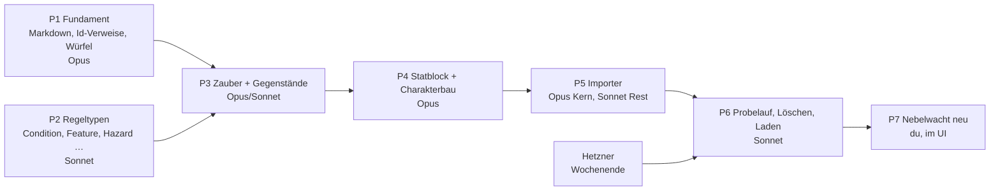

# 5e.tools übernehmen — Arbeitsplan

Stand 2026-10-08. Baut auf [5etools-Abgleich.md](5etools-Abgleich.md) auf:
dort steht, *was* fehlt; hier steht, *in welcher Reihenfolge* es gebaut
wird, mit welchem Modell, und wie man dabei nicht das ganze Kontingent
verbraucht.

---

## 1. Entschieden (D47, 2026-10-08)

| # | Frage | Entscheidung |
|---|---|---|
| E1 | Umfang | **Alles**, was auf 2014 aufbaut — nicht nur das SRD. Die Seite ist **nicht öffentlich**: jede Route ausser Anmeldung verlangt ein Konto, Konten gibt es nur auf Einladung. Eine spätere Demo zeigt nur SRD-Inhalt; dafür trägt jeder Artikel die Lizenzflagge (`Source.srd`) |
| E2 | Ausgabe | **2014 als Basis.** Die 2024-Kernbücher (`XPHB`, `XMM`, `XDMG`) kommen nicht herein, ebenso die Bücher seit September 2024, die auf den 2024-Regeln stehen (Heroes of Faerûn, Forge of the Artificer …), und Unearthed Arcana. Der Importer zählt sie auf; einschalten ist eine Zeile |
| E3 | Sprache | **Text englisch (Original), Namen deutsch nach offizieller Übersetzung.** Der Artikel heisst „Feuerball", der englische Name steht als Alias, der Regeltext bleibt englisch. Aufzählungswerte sind englische Schlüssel (`uncommon`), die Beschriftung ist der offizielle deutsche Begriff („ungewöhnlich"). Wo es keine offizielle Übersetzung gibt, bleibt der englische Name — **keine** Übersetzung durch ein Modell, das wäre nicht offiziell |
| E4 | Vehikel, Bastionen, Decks | später |
| E5 | Bilder | nicht im ersten Durchgang |
| E6 | Reihenfolge | Regeln, Zustände, Zauber, Gegenstände, Monster zuerst; Klassen und Abstammungen mit dem Bogen |
| E7 | Laden | **Einmal**, kein laufender Abgleich. Danach gehören die Artikel uns und werden direkt bearbeitet |

Was daraus folgt, gegenüber dem Abgleich:

- **Eine Systemebene statt einer je Buch.** „D&D 5e (2014)", `kind: system`;
  welches Buch, sagt `Source.publication` mit Seite. Hundert Ebenen für
  hundert Bücher wären ein Stapel, den niemand umschaltet.
- **Kein `overrides` aus `reprintedAs`**, weil 2024 nicht hereinkommt.
- **Keine stabile Id-Zuordnung über Läufe hinweg.** Der Importer darf
  während der Entwicklung beliebig oft gegen den Prüfbestand laufen; in
  den echten Bestand geht er einmal.
- **Der volle Bestand geht an den Server, nicht in den Prototyp.** Rund
  10 000 Artikel sind für die Artefakt-Ablage des Prototyps zu viel —
  geprüft ist das nicht, aber der Prototyp hält jeden Artikel im
  Speicher und zeichnet Listen ohne Seitenweise. Der Prototyp bekommt
  einen Ausschnitt (Abschnitt 5, P6).

### 1.1 Wie gross „alles" ist

Gemessen an `5etools-src` (Stand 2026-09-23), ohne Bilder und Begleittext:

| | Einträge |
|---|---:|
| alle Arten | 15 559 |
| davon 2024-Kernbücher | 3 182 |
| davon Bücher auf 2024-Regeln (seit 2024-09) | 1 078 |
| davon Unearthed Arcana | 118 |
| **2014-Basis** | **11 181** |
| davon später (E4: Karten, Decks, Vehikel) oder kein Artikel (Buch-Metadaten, Schablonen) | ~1 050 |
| **wird Artikel** | **~10 100** |

Die grössten Posten: 3 809 Monster, 1 649 Gegenstände, 1 307
Klassen- und Unterklassenmerkmale, 525 Zauber, 494 Gottheiten.

### 1.2 Woher die deutschen Namen kommen

| Quelle | Umfang | Lizenz | Stand |
|---|---|---|---|
| [`mhilbrunner/foundryvtt-dnd5e-lang-de`](https://github.com/mhilbrunner/foundryvtt-dnd5e-lang-de), Ordner `compendium/` | 2 101 Einträge des **SRD 2014**: 319 Zauber, 325 Monster, 818 Gegenstände, 238 Klassenmerkmale, 252 Monstermerkmale, Klassen, Unterklassen, Völker, Hintergründe, Tabellen — Name **und** deutscher Text, mit Seitenangabe im Spielerhandbuch („SHB S. 249") | MIT oder CC BY 4.0 | nicht mehr gepflegt, für 2014 aber vollständig |
| dieselbe, `languages/de.json` | 1 566 Begriffe der Oberfläche: Attribute, Fertigkeiten, Zustände, Schadensarten, Grössen, Seltenheiten | wie oben | — |
| dnddeutsch.de | die offiziellen Namen auch ausserhalb des SRD (Xanathar, Volo, Tasha …) | ungeklärt — vor der Nutzung beim Betreiber fragen | **von hier aus nicht erreichbar** (Netzrichtlinie der Umgebung); entweder die Domain freigeben oder die Liste lokal ziehen |

Damit sind die Namen im SRD gedeckt (~20 % der Artikel, aber die
meistgebrauchten). Für den Rest braucht es dnddeutsch.de oder die
Bücher; was offen bleibt, behält den englischen Namen und steht im
Bericht.

Bonus: für die 2 101 SRD-Einträge liegt der **deutsche Text** schon vor,
unter freier Lizenz. Ein späteres „auf Deutsch umstellen" kostet für
diesen Teil nichts.

---

## 2. Regeltypen: Ist „Zustand" ein eigener Typ?

**Ja.** Heute ist ein Zustand eine `Rule` mit `kind: condition`, und
`Vitals.conditions` verweist auf `Rule` mit dem Filter `kind = condition`.
Nach unserer eigenen Regel („Die Art hält, der Filter schlägt vor",
CLAUDE.md) ist dieser Filter nur ein Vorschlag der Maske: die Prüfung
nimmt jede Regel an — „Waffenangriff" als Zustand einer Kreatur geht
durch. Wer etwas einer Kreatur **zuweisen** will, braucht dafür eine Art.

Die Messlatte, für jede Regelart gleich:

> **Eine Regelart wird ein eigener Typ, wenn ein Verweisfeld oder eine
> Kante sie *als Art* verlangt, oder wenn sie eigene Felder trägt.
> Sonst bleibt sie ein Wort in `Rule.kind`.**

| Heute `Rule.kind` | wird | Grund |
|---|---|---|
| `condition` | **`Condition`** erbt `Rule` | `Vitals.conditions` und `participates.conditions` verlangen ihn; eigene Felder `levels` (Erschöpfung hat sechs Stufen) und `implies` (gelähmt, versteinert, betäubt, bewusstlos *schliessen* kampfunfähig *ein* — ein Verweis auf andere Zustände). `kind`: `condition` oder `status` (Konzentration, Überrascht) |
| — (5e.tools `disease`) | **`Disease`** erbt `Condition` | eigene Felder: Rettungswurf, SG, Inkubation, Übertragung. Eine Krankheit hat man, also ist sie zuweisbar wie ein Zustand |
| `feature` | **`Feature`** erbt `Rule` | die Kante `featureOf` (→ Klasse, Unterklasse, mit Stufe) verlangt es; eigene Felder `level`, `featureType` |
| — (5e.tools `itemProperty`, `itemMastery`) | **`ItemProperty`** erbt `Rule` | `hasProperty` (Gegenstand → Eigenschaft) verlangt es; `kind`: `property` oder `mastery` |
| — (5e.tools `spell`) | **`Spell`** erbt `Rule` | die Kante `casts` und zwanzig eigene Felder (Abgleich M2) |
| `feat`, `skill` | `Feat`, `Skill` — **gibt es schon** | der Wert in `Rule.kind` war doppelt: ein Talent war zugleich Typ `Feat` und Wort `feat`. Das Wort fällt weg |
| `action`, `bonus`, `reaction`, `trait`, `legendary`, `lair` + neu `regional`, `mythic` | bleiben **Wörter** | Teile eines Statblocks über `composedOf`; keine eigenen Felder, keine Kante, die genau sie verlangt |
| `travel` + neu `sense`, `reward`, `boon`, `option`, `rule` | bleiben **Wörter** | dasselbe |

Was das am Modell ändert: `Rule.kind` wird eine Aufzählungszeile
`RuleKind` mit den verbliebenen Wörtern und ist **nicht mehr Pflicht** —
ein Zauber oder ein Zustand braucht kein zweites Wort für das, was sein
Typ schon sagt. `Vitals.conditions` und `participates.conditions` zeigen
auf `Condition`. Die fünfzehn Zustände im heutigen Bestand müssen nicht
umgezogen werden: der Bestand wird ersetzt (Abgleich §4.4).

Das ist D48 (vorgeschlagen) und Teil von Paket P2.

---

## 3. Wo die Tokens hingehen — und wo nicht

Die wichtigste Zahl zuerst: **Das Übernehmen selbst kostet keine Tokens.**
Der Importer ist ein Skript; ob es 10 oder 10 000 Einträge liest, ist
für das Kontingent gleich. Tokens kostet nur das **Schreiben** des
Codes: die Modelländerungen und der Importer. Also lohnt sich alles,
was diese Sitzungen kurz hält.

| Hebel | Warum |
|---|---|
| **Eine neue Sitzung je Paket**, mit dem Auftrag aus Abschnitt 5 | Jede Antwort liest den ganzen bisherigen Verlauf mit. Eine lange Sitzung wird mit jedem Schritt teurer; diese hier ist es längst |
| **Der Auftrag nennt die Dateien** | Suchen ist der teuerste Teil einer Sitzung. Die Aufträge unten sagen, wo was liegt |
| **Keine Daten in den Kontext** | `5etools-src/data` ist 112 MB. Ein Skript zählt und fasst zusammen; gelesen werden fünf Beispieleinträge, nicht fünf Dateien |
| **Den Prototyp nie ganz lesen** | `nebelwacht-artikel.html` hat 674 KB, rund 170 000 Tokens. Gezielt mit `grep` und Ausschnitt |
| **Keine Migration für den heutigen Bestand** | Er wird ersetzt. Jedes Umzugsskript für 96 Artikel, die danach gelöscht werden, ist verbranntes Kontingent. Nur der Prüfbestand muss die Tests bestehen |
| **Ein PR je Paket, nicht je Änderung** | Weniger Runden aus Warten, CI lesen, Doku nachziehen. Die Commits darin bleiben klein |
| **Keine Unteragenten, kein Workflow** | Jeder startet ohne Kontext und liest selbst nach |
| **Keine Übersetzung durch das Modell** | 3,7 Mio. Tokens Text. In Claude Code wäre das ein Mehrfaches des ganzen Plans; und es wäre nicht offiziell (E3) |
| `CLAUDE.md` ist 39 KB (~10 000 Tokens) und steht in **jeder** Antwort jeder Sitzung | Dank Zwischenspeicher günstig, aber nicht gratis. Kürzen wäre ein eigener Schritt — nicht jetzt |

### 3.1 Spielt das Modell eine Rolle?

**Für das Ergebnis der Übernahme nicht.** Der Importer ist
deterministisch; die Namen kommen aus Tabellen. Das Modell entscheidet
nur, wie gut und wie schnell der *Code* entsteht.

**Für das Kontingent sehr.** Die Preise je Million Tokens (Anthropic-API,
Stand 2026-10) sind ein guter Massstab dafür, wie schnell ein Modell das
Kontingent eines Abos verbraucht — die genaue Gewichtung im Abo
veröffentlicht Anthropic nicht, die Reihenfolge stimmt aber:

| Modell | Eingabe | Ausgabe | gegenüber Sonnet |
|---|---:|---:|---:|
| Claude Fable 5.1 | $10 | $50 | 5× |
| Claude Opus 5.5 | $4 | $20 | 2× |
| Claude Sonnet 5.5 | $2 | $10 | 1× |
| Claude Haiku 5.5 | $0.10 | $0.50 | 0.05× |

**Empfehlung:**

- **Sonnet 5.5** für alles Mechanische: Registerzeilen, Aufzählungen,
  Doku, Katalog, Tests nachziehen, die Zuordnung je 5e.tools-Art im
  Importer, den Probelauf. Das ist mehr als die Hälfte der Arbeit.
- **Opus 5.5** für die drei Stellen, an denen Fehler teuer sind: der
  Textbaum nach Markdown samt Inline-Marken (P5-Kern), `_copy`
  auflösen, und die Modellteile in `packages/model` (Verweise auf Id,
  `enumRef` auf eine Artikelart, gerechnete Zauber-SG). Effort `high`.
- **Fable 5.1** nur, wenn eine Opus-Sitzung zweimal am selben Fehler
  hängen bleibt.
- **Haiku 5.5** nicht für Code. Aber: soll der *Regeltext* später
  deutsch werden, ist es der richtige Kandidat — über die Batch-API,
  ausserhalb von Claude Code (Abschnitt 6).
- Effort: `medium` für Sonnet-Pakete, `high` nur für den Importer-Kern.

Wie viel ein Paket wirklich kostet, zeigt `/usage` nach der ersten
Sitzung; danach lässt sich der Rest schätzen.

---

## 4. Die Pakete



| Paket | Inhalt (Abgleich §3) | Modell | Sitzungen |
|---|---|---|---:|
| **P1 Fundament** | M10 Markdown in langen Feldern (#61), M11 Verweise auf Id, M12 Würfel im Text | Opus | 1–2 |
| **P2 Regeltypen** | Abschnitt 2 oben (`Condition`, `Disease`, `Feature`, `ItemProperty`, `RuleKind`), M7 `Hazard`, `Deity`, `Faction.goal`, M8 `Table` mit Spalten, M9 Systemebene und `Source.srd` | Sonnet | 1 |
| **P3 Zauber und Gegenstände** | M2 `Spell` + `casts` + Zauberwirken am Statblock, M4 `Item` wächst | Opus für M2, Sonnet für M4 | 2 |
| **P4 Statblock und Charakterbau** | M5 Statblock, M3 `Class`/`Subclass`/`Ancestry`/`Background`, M6 Übungen aus Artikeln (`enumRef` auf eine Art) | Opus | 2 |
| **P5 Importer** | `packages/import-5etools`, Namentabelle, Bericht; `pnpm --filter @nw/server import <datei>` als Befehl statt Route (M13 schlanker); Lücke beim leeren Server schliessen (unten) | Opus Kern, Sonnet Zuordnungen | 2–3 |
| **P6 Laden** | Probelauf auf `dev`, Sicherung, Liste, Bestand ersetzen, Prüfbestand neu (M14), Ausschnitt in den Prototyp | Sonnet | 1 |
| **P7 Nebelwacht neu** | Welt, Kampagne, Gruppe, Figuren, Orte, Hausregeln — über der Systemebene | du, im UI; oder eine Sonnet-Sitzung aus der Sicherung | — |

P1 und P2 hängen nicht voneinander ab und dürfen in beliebiger
Reihenfolge laufen. P6 braucht den Server, also nach dem Wochenende.

**Eine Lücke, die P5 schliesst:** Solange es noch **kein** Konto gibt,
lässt der Server Lesezugriffe ohne Anmeldung durch („frischer Server:
lesen ja, schreiben nie", `apps/server/src/app.ts`). Mit leerem Bestand
ist das harmlos; mit 10 000 geladenen Artikeln nicht mehr. Der
Ladebefehl verweigert darum, solange kein Verwaltungskonto existiert,
und die Ausnahme gilt nur noch, solange auch der Bestand leer ist.

---

## 5. Die Aufträge

Je Paket ein Auftrag zum Einfügen in eine **neue** Sitzung. Sie sind
bewusst knapp: CLAUDE.md lädt die Regeln von selbst, die Dokumente hier
liefern den Inhalt.

### P1 — Fundament (Opus 5.5, Effort high)

```text
Paket P1 aus docs/5etools-Arbeitsplan.md: M10, M11, M12 aus docs/5etools-Abgleich.md §3.
- M10: Lange Textfelder (format: 'long') rendern Markdown — Listen, Tabellen, Überschriften, Hervorhebung. Kein HTML aus dem Text, kein eval. Ort: packages/model/src/inline.ts (Segmente), Darstellung in apps/web und im Prototyp (grep nach dem Rendern von format 'long', nicht die Datei ganz lesen).
- M11: [[id|Anzeige]] löst über Identity.id auf; [[Name]] bleibt als Eingabe erlaubt und wird beim Speichern zur Id, wenn eindeutig.
- M12: {{1d6+2}} ist ein Würfelausdruck im Text, klickbar wie die Würfel im Prototyp (REQ-070); {VAR} bleibt, wie es ist.
Tests in packages/model. Doku: Datenmodell.md, Begriffe.md, „How it works". Ein PR nach preprod, selbst mergen.
```

### P2 — Regeltypen (Sonnet 5.5, Effort medium)

```text
Paket P2 aus docs/5etools-Arbeitsplan.md, Abschnitt 2 und M7, M8, M9 aus docs/5etools-Abgleich.md §3 (M9 in der Fassung des Arbeitsplans: eine Systemebene, Source.srd).
Register in packages/registry/src (interfaces.ts, fieldgroups.ts, relations.ts, enums.ts), dann emit-seed und catalogue. Für einen Typ: node packages/registry/scripts/typ.mjs <Typ>.
Den heutigen Bestand NICHT migrieren — er wird ersetzt. Nur prototype/test/dbdump so anpassen, dass pnpm test grün ist.
Doku: Datenmodell.md, Begriffe.md, „How it works", Decision Log D48 auf decided. Ein PR nach preprod, selbst mergen.
```

### P3 — Zauber und Gegenstände (Opus 5.5 für M2, danach Sonnet für M4)

```text
Paket P3 aus docs/5etools-Arbeitsplan.md: M2 (Spell, casts, Zauberwirken am Statblock; SG und Angriffsbonus gerechnet, D8) und M4 (Item wächst) aus docs/5etools-Abgleich.md §3.
Feldliste aus §2.2 und §2.4 dort. Vorlage für die 5e.tools-Form: ein Eintrag „Fireball" und „Wand of Magic Missiles" — nur diese zwei lesen, nicht die Dateien.
Bestand nicht migrieren. Doku wie in CLAUDE.md. Ein PR nach preprod, selbst mergen.
```

### P4 — Statblock und Charakterbau (Opus 5.5, Effort high)

```text
Paket P4 aus docs/5etools-Arbeitsplan.md: M5, M3, M6 aus docs/5etools-Abgleich.md §3.
M6 ist eine Modelländerung in packages/model: enumRef darf eine Artikelart nennen (die Namen sichtbarer Artikel dieser Art), enumOptions() und der Prototyp (enumWerte) lesen beides. Danach fallen die Aufzählungszeilen Skill, Language, Tool, WeaponTraining, ArmorTraining, KnowledgeField und die Einstellung skills weg.
PlayerCharacter.level wird gerechnet (Summe der hasClass-Stufen).
Bestand nicht migrieren. Doku wie in CLAUDE.md. Ein PR nach preprod, selbst mergen.
```

### P5 — Importer (Opus 5.5 für den Kern, danach Sonnet)

```text
Paket P5 aus docs/5etools-Arbeitsplan.md: Importer nach docs/5etools-Abgleich.md §4.2, mit den Entscheidungen aus Arbeitsplan §1 (2014-Basis, eine Systemebene, Namen deutsch nach §1.2, Text englisch, einmaliges Laden).
Neues Paket packages/import-5etools, TypeScript, ohne Framework. Eingabe: Pfad zu einem Checkout von 5etools-src/data und zu foundryvtt-dnd5e-lang-de (beide ausserhalb des Repos). Ausgabe: Ausfuhrdatei (registry + entities) und ein Bericht (je Art: Anzahl, unübernommene Schlüssel mit Zähler, Namen ohne deutsche Übersetzung, Verweise ins Leere).
Kern zuerst (Opus): entries-Baum → Markdown, Inline-Marken → [[id|…]] / {{…}}, _copy auflösen. Die Zuordnung je Art danach (Sonnet).
Nie ganze Datendateien lesen; ein Skript fasst zusammen.
Dazu: Befehl pnpm --filter @nw/server import <datei> [--replace] (durch validateEntity; verweigert ohne Verwaltungskonto), und die Leseausnahme des leeren Servers nur bei leerem Bestand.
Ein PR nach preprod, selbst mergen.
```

### P6 — Laden (Sonnet 5.5, Effort medium)

```text
Paket P6 aus docs/5etools-Arbeitsplan.md, Ablauf nach docs/5etools-Abgleich.md §4.3 und §4.4.
Zuerst auf dev: Probelauf mit den Stichproben aus §4.3, Bericht prüfen. Dann Sicherung (Ausfuhr + pg_dump), Bestandsliste, Laden mit --replace. Prüfbestand prototype/test/dbdump aus einem Ausschnitt neu erzeugen; denselben Ausschnitt in den Prototyp.
Prod erst, wenn ich dev angeschaut habe.
```

---

## 6. Später: der Text auf Deutsch

Nicht Teil dieses Plans, aber damit die Rechnung dasteht:

- **SRD (2 101 Einträge):** der deutsche Text liegt im Foundry-Modul
  unter freier Lizenz. Kostet nichts ausser einem Zuordnungsschritt im
  Importer.
- **Der Rest (~8 000 Einträge, rund 3 Mio. Tokens Text):** das wäre
  eine Übersetzung, keine offizielle. Wenn gewünscht, über die
  Batch-API ausserhalb von Claude Code — Haiku 5.5 rund 1–2 Dollar,
  Sonnet 5.5 rund 20–25 Dollar für alles (Batch halbiert den Preis).
  Mit der Namentabelle als Glossar, damit „frightened" überall
  „verängstigt" heisst.

---

## 7. Was nur du tun kannst

- **Hetzner am Wochenende** nach [Betrieb.md](Betrieb.md); P6 wartet
  darauf.
- **dnddeutsch.de:** beim Betreiber fragen, ob die Namensliste genutzt
  werden darf, und entweder die Domain in den Netzwerkeinstellungen der
  Claude-Umgebung freigeben oder die Liste lokal ziehen und ins
  Prüfverzeichnis legen.
- **Je Paket eine neue Sitzung** mit dem Auftrag oben; das Modell vorher
  mit `/model` setzen.
- Release-PR [atlas-mentis#1](https://github.com/Mrfudog/atlas-mentis/pull/1)
  mergen, wenn prod mitziehen soll.
