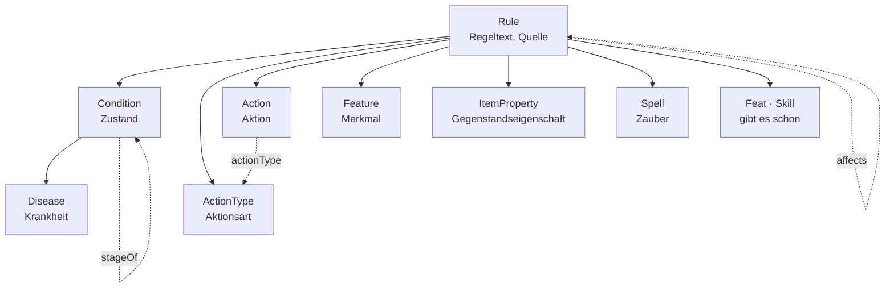
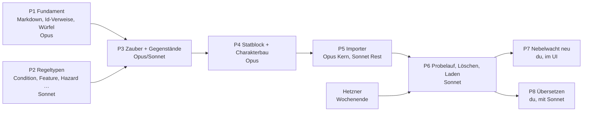

# 5e.tools übernehmen — Arbeitsplan

Stand 2026-10-08, überarbeitet nach Mikes Rückmeldung am selben Tag. Baut auf [5etools-Abgleich.md](5etools-Abgleich.md) auf:
dort steht, *was* fehlt; hier steht, *in welcher Reihenfolge* es gebaut
wird, mit welchem Modell, und wie man dabei nicht das ganze Kontingent
verbraucht.

---

## 1. Entschieden (D47, 2026-10-08)

| # | Frage | Entscheidung |
|---|---|---|
| E1 | Umfang | **Alles**, was auf 2014 aufbaut — nicht nur das SRD. Die Seite ist **nicht öffentlich**: jede Route ausser Anmeldung verlangt ein Konto, Konten gibt es nur auf Einladung. Eine spätere Demo zeigt nur SRD-Inhalt; dafür trägt jeder Artikel die Lizenzflagge (`Source.srd`) |
| E2 | Ausgabe | **2014 als Basis.** Die 2024-Kernbücher (`XPHB`, `XMM`, `XDMG`) kommen nicht herein, ebenso die Bücher seit September 2024, die auf den 2024-Regeln stehen (Heroes of Faerûn, Forge of the Artificer …), und Unearthed Arcana. Der Importer zählt sie auf; einschalten ist eine Zeile |
| E3 | Sprache | **Alles englisch, wie im Original** — Namen, Text, Aufzählungswerte und ihre Beschriftungen. Übersetzt wird danach von Mike, Begriff für Begriff (Paket P8). Der Importer übernimmt keine fremde Übersetzung |
| E4 | Vehikel, Bastionen, Decks | später |
| E5 | Bilder | nicht im ersten Durchgang |
| E6 | Reihenfolge | Regeln, Zustände, Zauber, Gegenstände, Monster zuerst; Klassen und Abstammungen mit dem Bogen |
| E7 | Laden | **Einmal**, kein laufender Abgleich. Danach gehören die Artikel uns und werden direkt bearbeitet |

Was daraus folgt, gegenüber dem Abgleich:

- **Eine Systemebene statt einer je Buch.** „D&D 5e (2014)", `kind: system`;
  welches Buch, sagt `Source.publication` mit Seite. Hundert Ebenen für
  hundert Bücher wären ein Stapel, den niemand umschaltet.
- **Kein `overrides` aus `reprintedAs`**, weil 2024 nicht hereinkommt.
- **Keine stabile Id-Zuordnung über Läufe hinweg.** Der Importer darf
  während der Entwicklung beliebig oft gegen den Prüfbestand laufen; in
  den echten Bestand geht er einmal.
- **Der volle Bestand geht an den Server, nicht in den Prototyp.** Rund
  10 000 Artikel sind für die Artefakt-Ablage des Prototyps zu viel —
  geprüft ist das nicht, aber der Prototyp hält jeden Artikel im
  Speicher und zeichnet Listen ohne Seitenweise. Der Prototyp bekommt
  einen Ausschnitt (Abschnitt 5, P6).

### 1.1 Wie gross „alles" ist

Gemessen an `5etools-src` (Stand 2026-09-23), ohne Bilder und Begleittext:

| | Einträge |
|---|---:|
| alle Arten | 15 559 |
| davon 2024-Kernbücher | 3 182 |
| davon Bücher auf 2024-Regeln (seit 2024-09) | 1 078 |
| davon Unearthed Arcana | 118 |
| **2014-Basis** | **11 181** |
| davon später (E4: Karten, Decks, Vehikel) oder kein Artikel (Buch-Metadaten, Schablonen) | ~1 050 |
| **wird Artikel** | **~10 100** |

Die grössten Posten: 3 809 Monster, 1 649 Gegenstände, 1 307
Klassen- und Unterklassenmerkmale, 525 Zauber, 494 Gottheiten.

### 1.2 Übersetzen kommt danach

Der Importer schreibt nur Englisch. Die Übersetzung ist ein eigener
Schritt (P8): ein Skript schreibt eine Liste aller Namen und
Aufzählungswerte als Tabelle (englisch, Art, Anzahl Verwendungen), Mike
trägt die deutschen Begriffe ein, und ein zweites Skript benennt die
Artikel um und legt den englischen Namen als Alias ab. Das kostet kaum
Tokens, weil kein Modell übersetzt; was offen ist, gehen wir zusammen
durch, die meistgebrauchten Begriffe zuerst.

---

## 2. Regeltypen

Stand nach Mikes Rückmeldung vom 2026-10-08. Ersetzt den ersten
Vorschlag (Zustand mit `levels` und `implies`).

### 2.1 Die Messlatte

> **Eine Regelart wird ein eigener Typ, wenn ein Verweisfeld oder eine
> Kante sie *als Art* verlangt, oder wenn sie eigene Felder trägt.
> Sonst bleibt sie ein Wort in `Rule.kind`.**

Heute ist ein Zustand eine `Rule` mit `kind: condition`, und
`Vitals.conditions` zeigt auf `Rule` mit einem Filter. Nach unserer
eigenen Regel („Die Art hält, der Filter schlägt vor") ist das nur ein
Vorschlag der Maske; die Prüfung nähme auch „Waffenangriff" als Zustand
einer Kreatur an. Was man einer Kreatur zuweisen will, braucht eine Art.

### 2.2 Die Familie



| Typ | Was er ist | Eigene Felder und Kanten | Warum ein Typ |
|---|---|---|---|
| **`Condition`** | Zustand: Blinded, Prone, Concentration, Exhaustion 3 | `kind` (`condition` · `status`); `stage` (Zahl); Kante **`stageOf`** auf den Grundzustand; `recovery` (`none` · `shortRest` · `longRest` · `longRestStep` · `save` · `special`) | `Vitals.conditions` und `participates.conditions` verlangen ihn |
| **`Disease`** erbt `Condition` | je Krankheit ein Artikel: Sewer Plague, Sight Rot | `save` (Attribut), `dc`, `incubation`, `transmission`; `kind` frei (mundane, magical …). Stadien wie bei Erschöpfung über `stageOf`, Spielarten über `variantOf` | eine Krankheit *hat* man, also ist sie zuweisbar wie ein Zustand, und sie trägt eigene Felder |
| **`ActionType`** | Aktionsart: Action, Bonus Action, Reaction, Free Object Interaction, Movement, Legendary Action, Lair Action | `per` (`turn` · `round`), `count` (wie oft) | vier Stellen verlangen ihn: `Action.actionType`, die Wirkzeit eines Zaubers, Einschränkungen durch Zustände (`affects`), später die Zonen im Inventar (heute Zeile `DrawTime`) |
| **`Action`** | Aktion: Dodge, Dash, Help, und jede Aktion eines Statblocks (Bite, Multiattack, Fire Breath) | **`actionType`** (Verweis, Pflicht); `recharge`, `uses`; für Angriffe `attack` (melee/ranged, weapon/spell), `toHit`, `reach`, `range`, `damage`, `damageType` | hat eigene Felder, und die Initiative kann damit rechnen statt Text zu lesen |
| **`Feature`** | Merkmal, also alles Dauerhafte: Klassenmerkmal, Volksmerkmal, Monstermerkmal (Nimble Escape), Regionaleffekt | `level`, `featureType`; Kante `featureOf` (→ Klasse, Unterklasse, mit Stufe) | `featureOf` verlangt es; Monster-, Volks- und Klassenmerkmale sind dieselbe Sache an verschiedenen Trägern |
| **`ItemProperty`** | Finesse, Versatile, Heavy; Waffenmeisterschaft gibt es erst 2024 | `abbreviation` | `hasProperty` (Gegenstand → Eigenschaft) verlangt es |
| **`Spell`** | Zauber | Abgleich M2; die Wirkzeit nennt bei Aktion, Bonusaktion und Reaktion den `ActionType` | Kante `casts`, zwanzig eigene Felder |
| `Feat`, `Skill` | gibt es schon | — | `Rule.kind` hatte die Wörter `feat` und `skill` zusätzlich: das war doppelt und fällt weg |

`Rule.kind` behält nur noch die Wörter für Regeln ohne Träger:
`rule` (Variantregeln), `travel`, `sense`, `reward`, `boon`, `option`.
Es wird eine Aufzählungszeile `RuleKind` und ist **nicht mehr Pflicht**,
denn ein Zauber braucht kein zweites Wort für das, was sein Typ sagt.
Die Statblock-Teile `action`, `bonus`, `reaction`, `legendary`, `lair`
sind jetzt `Action` mit der passenden Aktionsart, `trait` ist `Feature`.

### 2.3 Erschöpfung als sechs Zustände

**Geht, und wird nicht schwieriger, wenn die Stufen untereinander
verbunden sind.** Der Grundzustand „Exhaustion" trägt die allgemeine
Regel (Stufen sind kumulativ, eine lange Rast mit Essen und Trinken
senkt um eins, `recovery: longRestStep`). Darunter sechs Artikel
„Exhaustion 1" bis „Exhaustion 6", jeder mit `stage` und `stageOf` auf
den Grundzustand und mit seinem eigenen Text.

| | Eine Zahl (heute `Vitals.exhaustion`) | Sechs Zustände |
|---|---|---|
| Stufe senken nach langer Rast | Zahl minus eins | den Zustand durch die Stufe darunter **ersetzen**: gleicher `stageOf`, `stage − 1`; bei Stufe 1 entfernen |
| Stufe erhöhen | Zahl plus eins | ersetzen durch `stage + 1` |
| Was gilt bei Stufe 3 | im Text nachlesen | Stufen 1 bis 3 gelten, weil der Grundzustand „kumulativ" sagt; die Liste der Wirkungen ist gerechnet, nicht gespeichert (D8) |
| Andere Regeln können eine Stufe nennen | nein | ja: „Exhaustion 3" `affects` Angriffe mit Nachteil |
| Neue Regel nötig | — | **höchstens eine Stufe je Grundzustand** in der Zustandsliste; die Prüfung hält das |

Der Preis ist diese eine Prüfregel und ein Ersetzen statt Zählen. Dafür
fällt `Vitals.exhaustion` weg: die Stufe steht in der Zustandsliste, und
zwei Stellen für dieselbe Zahl laufen auseinander. Dasselbe Muster trägt
die Stadien einer Krankheit und später Wahnsinn (kurz, lang, unbefristet).

Wer die Rast auslöst, ist eine eigene Frage: heute niemand, die Stufe
wird von Hand umgestellt. Ein Knopf „lange Rast" an der Gruppe, der
jedes `recovery: longRestStep` eine Stufe senkt, ist ein späteres Stück
Bedienung und keine Modellfrage.

### 2.4 Wirkungen zwischen Regeln

Gelähmt *ist* nicht kampfunfähig; gelähmt **bewirkt** kampfunfähig, und
kampfunfähig **verbietet** Aktionen und Reaktionen. Das sind Kanten, kein
Feld am Zustand:

| Kante | von → nach | `props.effect` | Beispiel |
|---|---|---|---|
| **`affects`** | Rule → Rule | `imposes` (bewirkt), `prevents` (verbietet), `limits` (schränkt ein), `advantage`, `disadvantage`, `triggers` (löst aus); dazu `on` (worauf: attack, save, check, Attribut) und `note` | Paralyzed `imposes` Incapacitated · Incapacitated `prevents` Action, Reaction · Exhaustion 3 `disadvantage` on attack · Unconscious `triggers` Prone |

Gespeichert wird vorwärts, die Gegenfrage („was verbietet mir
Reaktionen?") ist eine Abfrage. **Ausgewertet wird vorerst nichts**: die
Kanten sind Daten, die der Bogen anzeigt („Weil gelähmt: kampfunfähig").
Eine Regelmaschine, die daraus Vor- und Nachteile rechnet, ist ein
eigenes Vorhaben.

Der Importer legt diese Kanten **nicht** an. Dass ein Zustand im Text
einen anderen nennt, heisst nicht, dass er ihn bewirkt („can't be
frightened" nennt verängstigt auch). Die 15 Zustände und die
Erschöpfungsstufen bekommen ihre Wirkungen von Hand, mit Mike; das sind
rund dreissig Kanten.

### 2.5 Einmal übernehmen, als unsere Artikel

Jeder 5e.tools-Eintrag wird ein Artikel **unseres** Typs mit gefüllten
Feldern und liegt danach in unserer Datenbank. Nichts zeigt zurück auf
5e.tools: keine URL, kein Nachladen, kein Abgleich. Welches Buch und
welche Seite, steht in `Source` als Text. Was im Text auf einen anderen
Eintrag zeigt (`{@spell fireball}`), wird ein Verweis auf **unseren**
importierten Artikel — das ist die einzige Verknüpfung, und sie bleibt
innerhalb des Bestands.

Das Monster selbst wird dabei zerlegt: der Statblock ist ein Artikel,
seine Aktionen und Merkmale sind eigene `Action`- und `Feature`-Artikel
über `composedOf`. Gleichlautende Merkmale über Monster hinweg legt der
Importer **einmal** an (Pack Tactics, Magic Resistance), mit `{VAR}` für
das, was sich unterscheidet. Das ist der Grund, warum die Aktionen Typen
sind und nicht Text am Statblock.

Das ist D48 (vorgeschlagen) und Paket P2; `Action` mit Angriffsfeldern
kommt mit dem Statblock in P4.

---

## 3. Wo die Tokens hingehen — und wo nicht

Die wichtigste Zahl zuerst: **Das Übernehmen selbst kostet keine Tokens.**
Der Importer ist ein Skript; ob es 10 oder 10 000 Einträge liest, ist
für das Kontingent gleich. Tokens kostet nur das **Schreiben** des
Codes: die Modelländerungen und der Importer. Also lohnt sich alles,
was diese Sitzungen kurz hält.

| Hebel | Warum |
|---|---|
| **Eine neue Sitzung je Paket**, mit dem Auftrag aus Abschnitt 5 | Jede Antwort liest den ganzen bisherigen Verlauf mit. Eine lange Sitzung wird mit jedem Schritt teurer; diese hier ist es längst |
| **Der Auftrag nennt die Dateien** | Suchen ist der teuerste Teil einer Sitzung. Die Aufträge unten sagen, wo was liegt |
| **Keine Daten in den Kontext** | `5etools-src/data` ist 112 MB. Ein Skript zählt und fasst zusammen; gelesen werden fünf Beispieleinträge, nicht fünf Dateien |
| **Den Prototyp nie ganz lesen** | `nebelwacht-artikel.html` hat 674 KB, rund 170 000 Tokens. Gezielt mit `grep` und Ausschnitt |
| **Keine Migration für den heutigen Bestand** | Er wird ersetzt. Jedes Umzugsskript für 96 Artikel, die danach gelöscht werden, ist verbranntes Kontingent. Nur der Prüfbestand muss die Tests bestehen |
| **Ein PR je Paket, nicht je Änderung** | Weniger Runden aus Warten, CI lesen, Doku nachziehen. Die Commits darin bleiben klein |
| **Keine Unteragenten, kein Workflow** | Jeder startet ohne Kontext und liest selbst nach |
| **Keine Übersetzung durch das Modell** | 3,7 Mio. Tokens Text. In Claude Code wäre das ein Mehrfaches des ganzen Plans; Mike übersetzt selbst (E3) |
| `CLAUDE.md` ist 39 KB (~10 000 Tokens) und steht in **jeder** Antwort jeder Sitzung | Dank Zwischenspeicher günstig, aber nicht gratis. Kürzen wäre ein eigener Schritt — nicht jetzt |

### 3.1 Spielt das Modell eine Rolle?

**Für das Ergebnis der Übernahme nicht.** Der Importer ist
deterministisch; die Namen kommen aus Tabellen. Das Modell entscheidet
nur, wie gut und wie schnell der *Code* entsteht.

**Für das Kontingent sehr.** Die Preise je Million Tokens (Anthropic-API,
Stand 2026-10) sind ein guter Massstab dafür, wie schnell ein Modell das
Kontingent eines Abos verbraucht — die genaue Gewichtung im Abo
veröffentlicht Anthropic nicht, die Reihenfolge stimmt aber:

| Modell | Eingabe | Ausgabe | gegenüber Sonnet |
|---|---:|---:|---:|
| Claude Fable 5.1 | $10 | $50 | 5× |
| Claude Opus 5.5 | $4 | $20 | 2× |
| Claude Sonnet 5.5 | $2 | $10 | 1× |
| Claude Haiku 5.5 | $0.10 | $0.50 | 0.05× |

**Empfehlung:**

- **Sonnet 5.5** für alles Mechanische: Registerzeilen, Aufzählungen,
  Doku, Katalog, Tests nachziehen, die Zuordnung je 5e.tools-Art im
  Importer, den Probelauf. Das ist mehr als die Hälfte der Arbeit.
- **Opus 5.5** für die drei Stellen, an denen Fehler teuer sind: der
  Textbaum nach Markdown samt Inline-Marken (P5-Kern), `_copy`
  auflösen, und die Modellteile in `packages/model` (Verweise auf Id,
  `enumRef` auf eine Artikelart, gerechnete Zauber-SG). Effort `high`.
- **Fable 5.1** nur, wenn eine Opus-Sitzung zweimal am selben Fehler
  hängen bleibt.
- **Haiku 5.5** nicht für Code.
- Effort: `medium` für Sonnet-Pakete, `high` nur für den Importer-Kern.

Wie viel ein Paket wirklich kostet, zeigt `/usage` nach der ersten
Sitzung; danach lässt sich der Rest schätzen.

---

## 4. Die Pakete



| Paket | Inhalt (Abgleich §3) | Modell | Sitzungen |
|---|---|---|---:|
| **P1 Fundament** | M10 Markdown in langen Feldern (#61), M11 Verweise auf Id, M12 Würfel im Text | Opus | 1–2 |
| **P2 Regeltypen** | Abschnitt 2 oben: `Condition` mit Stufen, `Disease`, `ActionType`, `Action` (ohne Angriffsfelder), `Feature`, `ItemProperty`, Kante `affects`, `RuleKind`; `Vitals.exhaustion` fällt weg. Dazu M7 `Hazard`, `Deity`, `Faction.goal`, M8 `Table` mit Spalten, M9 Systemebene und `Source.srd` | Sonnet | 1–2 |
| **P3 Zauber und Gegenstände** | M2 `Spell` + `casts` + Zauberwirken am Statblock, M4 `Item` wächst | Opus für M2, Sonnet für M4 | 2 |
| **P4 Statblock und Charakterbau** | M5 Statblock, `Action` mit Angriffsfeldern, M3 `Class`/`Subclass`/`Ancestry`/`Background`, M6 Übungen aus Artikeln (`enumRef` auf eine Art) | Opus | 2 |
| **P5 Importer** | `packages/import-5etools`, Bericht; `pnpm --filter @nw/server import <datei>` als Befehl statt Route (M13 schlanker); Lücke beim leeren Server schliessen (unten) | Opus Kern, Sonnet Zuordnungen | 2–3 |
| **P6 Laden** | Probelauf auf `dev`, Sicherung, Liste, Bestand ersetzen, Prüfbestand neu (M14), Ausschnitt in den Prototyp | Sonnet | 1 |
| **P7 Nebelwacht neu** | Welt, Kampagne, Gruppe, Figuren, Orte, Hausregeln — über der Systemebene | du, im UI; oder eine Sonnet-Sitzung aus der Sicherung | — |
| **P8 Übersetzen** | Begriffsliste ausgeben, Mike füllt sie, Skript benennt um (§1.2); die Wirkungen der Zustände von Hand (§2.4) | Sonnet, mit dir | 1 |

P1 und P2 hängen nicht voneinander ab und dürfen in beliebiger
Reihenfolge laufen. P6 braucht den Server, also nach dem Wochenende.

**Eine Lücke, die P5 schliesst:** Solange es noch **kein** Konto gibt,
lässt der Server Lesezugriffe ohne Anmeldung durch („frischer Server:
lesen ja, schreiben nie", `apps/server/src/app.ts`). Mit leerem Bestand
ist das harmlos; mit 10 000 geladenen Artikeln nicht mehr. Der
Ladebefehl verweigert darum, solange kein Verwaltungskonto existiert,
und die Ausnahme gilt nur noch, solange auch der Bestand leer ist.

---

## 5. Die Aufträge

Je Paket ein Auftrag zum Einfügen in eine **neue** Sitzung. Sie sind
bewusst knapp: CLAUDE.md lädt die Regeln von selbst, die Dokumente hier
liefern den Inhalt.

### P1 — Fundament (Opus 5.5, Effort high)

```text
Paket P1 aus docs/5etools-Arbeitsplan.md: M10, M11, M12 aus docs/5etools-Abgleich.md §3.
- M10: Lange Textfelder (format: 'long') rendern Markdown — Listen, Tabellen, Überschriften, Hervorhebung. Kein HTML aus dem Text, kein eval. Ort: packages/model/src/inline.ts (Segmente), Darstellung in apps/web und im Prototyp (grep nach dem Rendern von format 'long', nicht die Datei ganz lesen).
- M11: [[id|Anzeige]] löst über Identity.id auf; [[Name]] bleibt als Eingabe erlaubt und wird beim Speichern zur Id, wenn eindeutig.
- M12: {{1d6+2}} ist ein Würfelausdruck im Text, klickbar wie die Würfel im Prototyp (REQ-070); {VAR} bleibt, wie es ist.
Tests in packages/model. Doku: Datenmodell.md, Begriffe.md, „How it works". Ein PR nach preprod, selbst mergen.
```

**Stand 2026-10-09: steht.** `parseMarkdown` (`markdown.ts`), `rollDice`
(`dice.ts`), `idLinks` und `linkCandidates`; gezeichnet in `apps/web`
(`nw-text`) und im Prototyp (`para`). Regel und Tabelle in
[Datenmodell.md](Datenmodell.md) §4.4. Offen: der Server schreibt
`[[Name]]` nicht selbst um — das tun die beiden Masken; der Importer
(P5, Schritt 15) schreibt die Nummer ohnehin direkt.

### P2 — Regeltypen (Sonnet 5.5, Effort medium)

```text
Paket P2 aus docs/5etools-Arbeitsplan.md: Abschnitt 2 ganz (Condition mit stage/stageOf/recovery, Disease, ActionType, Action ohne Angriffsfelder, Feature, ItemProperty, Kante affects, RuleKind als Zeile und nicht mehr Pflicht, Vitals.exhaustion fällt weg, höchstens eine Stufe je Grundzustand in der Zustandsliste) und M7, M8, M9 aus docs/5etools-Abgleich.md §3 (M9 in der Fassung des Arbeitsplans: eine Systemebene, Source.srd).
Register in packages/registry/src (interfaces.ts, fieldgroups.ts, relations.ts, enums.ts), Prüfregel in packages/model, dann emit-seed und catalogue. Für einen Typ: node packages/registry/scripts/typ.mjs <Typ>.
Den heutigen Bestand NICHT migrieren — er wird ersetzt. Nur prototype/test/dbdump so anpassen, dass pnpm test grün ist.
Doku: Datenmodell.md, Begriffe.md, „How it works", Decision Log D48 auf decided. Ein PR nach preprod, selbst mergen.
```

### P3 — Zauber und Gegenstände (Opus 5.5 für M2, danach Sonnet für M4)

```text
Paket P3 aus docs/5etools-Arbeitsplan.md: M2 (Spell, casts, Zauberwirken am Statblock; SG und Angriffsbonus gerechnet, D8) und M4 (Item wächst) aus docs/5etools-Abgleich.md §3.
Feldliste aus §2.2 und §2.4 dort. Vorlage für die 5e.tools-Form: ein Eintrag „Fireball" und „Wand of Magic Missiles" — nur diese zwei lesen, nicht die Dateien.
Bestand nicht migrieren. Doku wie in CLAUDE.md. Ein PR nach preprod, selbst mergen.
```

### P4 — Statblock und Charakterbau (Opus 5.5, Effort high)

```text
Paket P4 aus docs/5etools-Arbeitsplan.md: M5, M3, M6 aus docs/5etools-Abgleich.md §3.
M6 ist eine Modelländerung in packages/model: enumRef darf eine Artikelart nennen (die Namen sichtbarer Artikel dieser Art), enumOptions() und der Prototyp (enumWerte) lesen beides. Danach fallen die Aufzählungszeilen Skill, Language, Tool, WeaponTraining, ArmorTraining, KnowledgeField und die Einstellung skills weg.
PlayerCharacter.level wird gerechnet (Summe der hasClass-Stufen).
Bestand nicht migrieren. Doku wie in CLAUDE.md. Ein PR nach preprod, selbst mergen.
```

### P5 — Importer (Opus 5.5 für den Kern, danach Sonnet)

```text
Paket P5 aus docs/5etools-Arbeitsplan.md: Importer nach docs/5etools-Abgleich.md §4.2, mit den Entscheidungen aus Arbeitsplan §1 (2014-Basis, eine Systemebene, alles englisch, einmaliges Laden) und §2.5 (Statblock zerlegt in Action und Feature, gleichlautende Merkmale einmal).
Neues Paket packages/import-5etools, TypeScript, ohne Framework. Eingabe: Pfad zu einem Checkout von 5etools-src/data (ausserhalb des Repos). Ausgabe: Ausfuhrdatei (registry + entities) und ein Bericht (je Art: Anzahl, unübernommene Schlüssel mit Zähler, Verweise ins Leere). Die Wirkungskanten affects legt der Importer nicht an.
Kern zuerst (Opus): entries-Baum → Markdown, Inline-Marken → [[id|…]] / {{…}}, _copy auflösen. Die Zuordnung je Art danach (Sonnet).
Nie ganze Datendateien lesen; ein Skript fasst zusammen.
Dazu: Befehl pnpm --filter @nw/server import <datei> [--replace] (durch validateEntity; verweigert ohne Verwaltungskonto), und die Leseausnahme des leeren Servers nur bei leerem Bestand.
Ein PR nach preprod, selbst mergen.
```

### P6 — Laden (Sonnet 5.5, Effort medium)

```text
Paket P6 aus docs/5etools-Arbeitsplan.md, Ablauf nach docs/5etools-Abgleich.md §4.3 und §4.4.
Zuerst auf dev: Probelauf mit den Stichproben aus §4.3, Bericht prüfen. Dann Sicherung (Ausfuhr + pg_dump), Bestandsliste, Laden mit --replace. Prüfbestand prototype/test/dbdump aus einem Ausschnitt neu erzeugen; denselben Ausschnitt in den Prototyp.
Prod erst, wenn ich dev angeschaut habe.
```

---

## 6. Später: der Regeltext auf Deutsch

Nicht Teil dieses Plans. P8 übersetzt Namen und Begriffe; der Regeltext
bleibt englisch, bis Mike anders entscheidet. Wenn es so weit ist, ist
die Begriffsliste aus P8 das Glossar, damit „frightened" überall gleich
heisst.

---

## 7. Was nur du tun kannst

- **Hetzner am Wochenende** nach [Betrieb.md](Betrieb.md); P6 wartet
  darauf.
- **Je Paket eine neue Sitzung** mit dem Auftrag oben; das Modell vorher
  mit `/model` setzen.
- Release-PR [atlas-mentis#1](https://github.com/Mrfudog/atlas-mentis/pull/1)
  mergen, wenn prod mitziehen soll.
