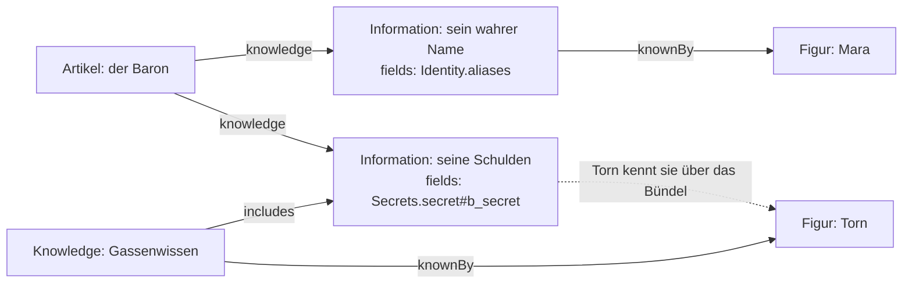

# Wissen — wer weiss was

Stand 2026-09-20, nachgeführt 2026-10-07. Das ist A6 aus dem [Fahrplan](Roadmap.md), gebaut nach
Entscheidung 4: *„Wissen: selbst festlegen, über ein Seitenpanel in der
Artikelansicht."*

---

## Die Einheit dazwischen

Ein Artikel trägt Felder und Textblöcke. Manches davon liegt offen, manches
nicht — und *wer* was weiss, ist nicht für alle gleich. Die naheliegende
Lösung wäre ein Attribut am Feld: „geheim, ausser für Mara". Sie trägt nicht.
Ein Attribut fasst einen Empfänger, nicht drei. Es ist nicht abfragbar — „wer
weiss vom wahren Namen des Barons?" müsste jedes Feld jedes Artikels
durchsuchen. Und es kann nicht mehrere Felder zusammenhalten, die nur
gemeinsam Sinn ergeben.

Deshalb gibt es eine Einheit dazwischen: die **Information**. Sie bündelt
Felder und Blöcke eines Artikels und wird als Ganzes zugeteilt.

Und weil sie Kanten tragen muss, ist sie ein **eigener Artikel** — im
Rückgrat trägt nur ein Peg Kanten. Damit ist „wer weiss davon?" ein Rückbezug
wie jeder andere, und eine Information kann selbst eine Beschreibung, einen
Stand und Marken haben.

```
Artikel      --knowledge-->  Information        (owned)
Knowledge    --includes-->   Information        (ein Bündel)
Information | Knowledge --knownBy--> Creature | Party | Faction
```



Drei Kantenarten und zwei Artikelarten. Kein neues Konstrukt.

> **Nicht mehr (seit 2026-09-20):** der `KnowledgeLevel`, ein *Stand*, dem
> Figuren über `atLevel` angehörten. Ein Bündel (`Knowledge`) tut dasselbe
> über dieselbe Kante, und einen Stand hatte in zwei Jahren niemand benutzt.

---

## Die Zeilen

| Zeile | Art | Was sie sagt |
|---|---|---|
| `Information` | Artikelart (rules) | eigene Felder `fields[]`, `tier`; dazu die Grundausstattung |
| `Knowledge` | Artikelart (rules) | ein Bündel; keine eigenen Felder, die Kante `includes` |
| `knowledge` | Kante | Artikel → Information, `owned` |
| `includes` | Kante | Knowledge → Information |
| `knownBy` | Kante | Information, Knowledge → Creature, Party, Faction |
| `knowledge` | Layout-Element | der Artikel nach Informationen geordnet |

`Information.fields` schreibt Feldverweise in derselben Schreibweise wie die
Ansichten: `Abilities` nimmt jedes Feld dieser Art, `Statblock.ac` genau ein
Feld, `Secrets.secret#id` **einen Eintrag** eines Feldes mit `many`. Zwei
Schreibweisen für dieselbe Sache wären eine zu viel.

`tier` ist **nur Anzeige und Sortierung**. Was jemand sehen darf, entscheiden
die Kanten. Ein Rang, der es mitentscheidet, wäre eine zweite Quelle, die der
ersten widersprechen kann.

---

## Die Kante hängt am Artikel, nicht an der Information

`knowledge` wird auf dem Artikel gespeichert: `Baron → knowledge →
„Sein wahrer Name"`. Zwei Gründe.

Erstens liegt die Liste damit dort, wo das Seitenpanel sie bearbeitet.
Zweitens greift `owned`: löscht man den Artikel, sterben seine Bündel mit,
statt als Information über nichts zurückzubleiben.

`knownBy` hängt umgekehrt an der **Information**, nicht am Empfänger. Sonst
müsste jede Figur eine Liste dessen pflegen, was sie weiss — und etwas zu
entziehen hiesse, es dort wiederzufinden. So ist Zuteilen eine Kante mehr,
Entziehen eine weniger, und beides fasst den Artikel nicht an: dass jemand
etwas erfährt, ändert den Baron nicht.

---

## Was offen ist, ist offen

**Ein Feld, das keine Information nennt, liegt offen.**

Die Umkehrung — alles zu, bis jemand es freigibt — ist sicherer, und sie wäre
die falsche Wahl. Sie macht jede neue Zeile unsichtbar, bis jemand daran
denkt, und eine Spieleransicht, die standardmässig leer ist, benutzt niemand.
Nach zwei Sitzungen hätte jemand eine Information „Alles" angelegt und sie an
alle gehängt, und dann wäre die Regel wieder da, wo sie jetzt ist — nur
unsichtbar.

Der Preis ist ein Vergessen, das leckt. Dagegen steht, dass die Wissensansicht
die **offene Gruppe zuoberst** zeigt: man sieht immer, was gerade offen liegt,
statt es erschliessen zu müssen.

> Die Sichtbarkeit des *ganzen* Artikels regeln weiterhin die Felder
> `Visibility`. Wissen verfeinert innerhalb eines Artikels, den jemand
> ohnehin sehen darf. Die beiden schliessen einander nicht aus: was
> `Visibility` verbirgt, erreicht kein Wissen.

---

## Auflösung

Was ein Betrachter weiss, ist immer eine Abfrage — nie ein gespeicherter Wert
(D8):

```
träger(Betrachter) := Betrachter
                    ∪ { P | Betrachter --memberOfParty--> P }
                    ∪ { F | Betrachter --memberOf--> F }

erreicht(Betrachter, Zuteilung --knownBy--> t) :=
      t ∈ träger(Betrachter)
   ∧  ( Zuteilung nennt keinen Rang
      ∨ rang(Betrachter, t) ≥ Zuteilung.rank     in der Leiter t.Faction.ranks )

kennt(Betrachter, Information) :=
      erreicht(Betrachter, Information --knownBy--> t)
   ∨  Knowledge --includes--> Information
      ∧ erreicht(Betrachter, Knowledge --knownBy--> t)
```

Einen Schritt weit, nicht transitiv: ein Bündel in einem Bündel zählt nicht,
und eine Gruppe in einer Gruppe auch nicht. Eine Hierarchie hat niemand
verlangt, und sie wäre die Stelle, an der eine Freigabe weiter reicht, als
jemand gemeint hat.

**Die Fraktion weiss nichts — ihre Mitglieder wissen** (7.10., Abgleich
A7, REQ-203). `Faction.ranks` ist ihre Leiter, der niedrigste Rang zuerst;
`memberOf.props.rank` sagt, auf welcher Sprosse ein Mitglied steht; eine
Zuteilung an die Fraktion darf mit `knownBy.props.rank` einen
**Mindestrang** nennen — was der Zirkel weiss, weiss der Novize noch nicht.
Ohne Rang an der Zuteilung erreicht sie jedes Mitglied; ein Mitglied ohne
Rang steht unter der untersten Sprosse; ein Rang, der nicht in der Leiter
steht, schliesst nichts auf (ein Tippfehler darf keine Tür öffnen). Zwei
Figuren eines Kontos: die höhere Sprosse zählt. `hiddenFrom` und
`revealedTo` nennen die Fraktion ohne Rang — sie meinen jedes Mitglied.

**Ein Betrachter ist eine Liste, keine Id.** Ein Konto führt mehrere Figuren,
und wer zwei spielt, weiss am Tisch, was beide wissen — eine Seite, die ihm
das eine vorenthält, während er auf das andere schaut, zwingt ihn zum
Umschalten und sonst zu nichts. Gerechnet wird über die Vereinigung.

Eine **leere** Liste ist dabei nicht dasselbe wie **keine**: `undefined`
heisst Spielleitung und sieht alles, `[]` heisst ein Konto ohne Figur und
sieht genau das Offene.

---

## Die Gruppe

`Party` ist das Figurengefüge einer Runde: Rook, Sela und der Rest ziehen
zusammen los. Sie hängt an ihrer Kampagne (`partyOf`, genau eine), und
ihre Figuren sind darüber Teil der Kampagne (`memberOfParty`). Wissen an
die Party zu geben erreicht jedes Mitglied, und das ist richtig so.

Es gab daneben `Group` — eine Gruppe von Konten für „die Spieler dieser
Kampagne“, wer noch keine Figur hat, wer zusieht. Mitglied wurde ein
Konto am Server, indem es die Gruppe wie eine Figur führte
(`app_user_actor`); im Register und im Prototyp gab es dafür keine Kante,
dort erreichte sie niemanden. Und seit `campaign_member` sind die Spieler
einer Kampagne eine **Rolle**: `audience: players` sagt es, `audience: campaign` nimmt die
Zuschauer dazu. Zwei Spieler mit einem gemeinsamen Geheimnis bekommen es
als Figuren oder als zweite Party. `Group` ist seit dem 7.10. weg (A8).

## Die Oberfläche

**Die Ansicht „Knowledge"** zeigt den Artikel nach Informationen geordnet:
zuoberst „Open" mit gestricheltem Rand, darunter je ein Kasten pro
Information. Jeder Kasten nennt in seiner Kopfzeile den Rang und die
Empfänger. Die Felder sind dort so bearbeitbar wie in jeder anderen Ansicht.

**Das Seitenpanel** hat zwei Reiter, „Relations" und „Knowledge". Im zweiten:
eine Information wählen oder anlegen, ihren Rang setzen, Felder und Blöcke
ankreuzen, Empfänger zuteilen und wieder entziehen. Ein Feld, das schon in
einer anderen Information steht, ist grau und sagt es im Tooltip — verboten
ist es nicht, denn dasselbe Feld kann auf zwei Wegen bekannt werden.

---

## Was noch offen ist

1. ~~**Die Spieleransicht selbst.**~~ Steht seit 2026-09-20: der Server siebt
   (`redactEntity`), siehe [Zugang.md](Zugang.md).
2. ~~**Blöcke haben keinen stabilen Anker.**~~ Ein Textblock ist ein Feld mit
   `many`, und die Id jedes Eintrags kommt aus dem Text — sie übersteht einen
   Import ([Spieltisch.md](Spieltisch.md), Blockanker).
3. **Wissen an Kanten.** Eine Information bündelt heute Felder und Einträge.
   Ob eine *Verbindung* („der Baron kennt Floon") ebenso zuteilbar sein soll,
   ist nicht entschieden; die Kanten gehen heute immer mit.
4. ~~**Die Fraktion als Träger** — Abgleich A7.~~ Entschieden am 7.10.:
   Mitglieder je Rang, siehe oben.
